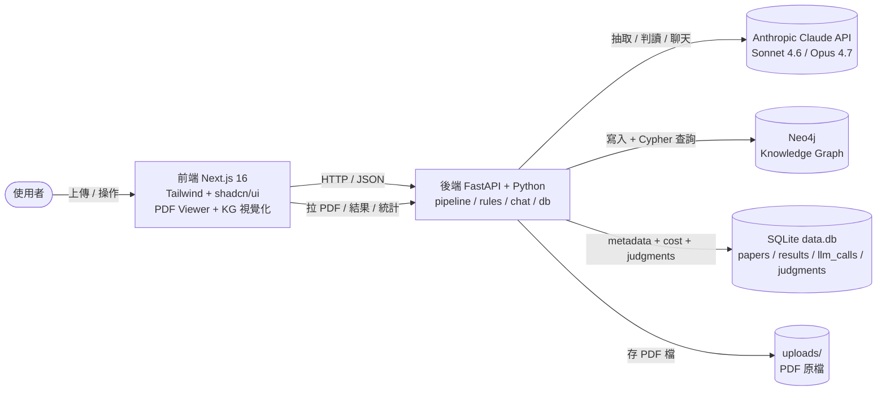
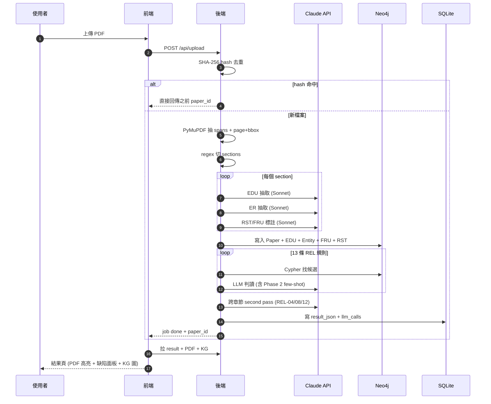
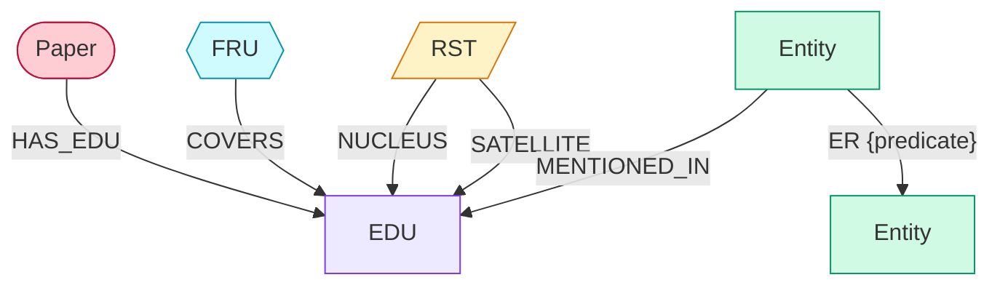
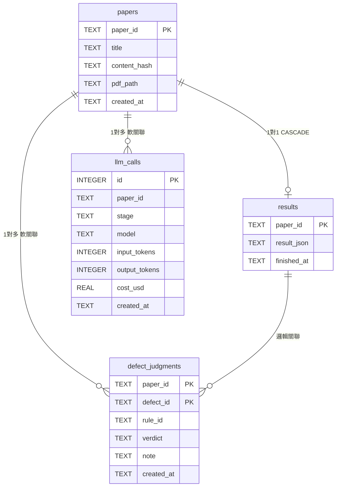
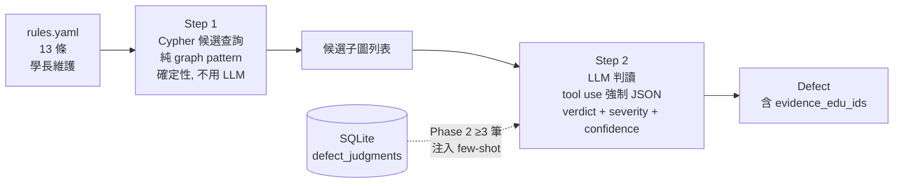
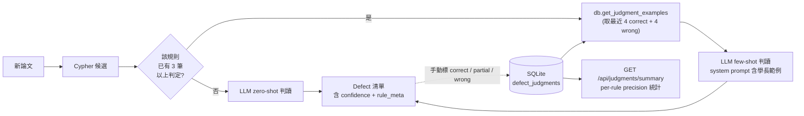

# 論文檢核系統 v3 — Demo Report

> 用 Knowledge Graph + LLM 自動找學術論文的邏輯結構性缺陷
> A Neurosymbolic Approach to Thesis Logical Defect Detection

上傳論文 → 抽取 EDU / Entity / RST / FRU 四層結構並寫入 Neo4j Knowledge Graph → 用 13 條 REL 規則檢核（Cypher 找候選 + LLM 判讀）→ 輸出邏輯缺陷與修改建議。搭配 Human-as-judge 標註介面與 Phase 2 few-shot 回饋，閉合人工標註迴路。

---

## 目錄

1. [系統定位](#1-系統定位)
2. [系統架構](#2-系統架構)
3. [Pipeline 時序圖](#3-pipeline-時序圖)
4. [Knowledge Graph 資料結構](#4-knowledge-graph-資料結構)
5. [SQLite 資料結構（RDS）](#5-sqlite-資料結構rds)
6. [13 條 REL 規則 + Hybrid 檢核](#6-13-條-rel-規則--hybrid-檢核)
7. [範例走查 — Vaswani 2017](#7-範例走查--vaswani-2017-attention-is-all-you-need)
8. [Phase 2 — 閉合人工標註迴路](#8-phase-2--閉合人工標註迴路)
9. [論文助手聊天 + Guardrails](#9-論文助手聊天--guardrails)
10. [理論文獻支撐](#10-理論文獻支撐)

---

## 1. 系統定位

學術論文初稿常見三類「結構性」問題：(1) 主張無證據、(2) 缺乏動機、(3) 跨章節失聯。傳統靠人工 review 抓，慢且主觀。本系統把這個過程自動化、可重現、可追溯。

### 跟「直接問 ChatGPT 改論文」差在哪？

| 維度 | 純 LLM 對話 | 本系統 |
|---|---|---|
| 結果可重現 | ❌ 每次答案不同 | ✅ KG + 規則確定性 |
| 追溯到原文位置 | ❌ 描述模糊 | ✅ 高亮 PDF 句子（page + bbox） |
| 規則可由人維護 | ❌ 黑盒 | ✅ 規則寫在 YAML，學長可改 |
| 跨論文比較 | ❌ | ✅ KG 持久化於 Neo4j |
| 投論文的方法論支撐 | ❌ | ✅ Neurosymbolic（KG + LLM hybrid） |

---

## 2. 系統架構

前後端分離 + 三層儲存。前端 Next.js 16 + Tailwind + shadcn/ui，後端 FastAPI；Neo4j 存 KG（給 Cypher 查詢）、SQLite 存中繼資料/分析結果/cost log/人工判定、本地磁碟存 PDF 原檔。



---

## 3. Pipeline 時序圖

從上傳到結果回來大概 1–3 分鐘。SHA-256 hash 命中快取則秒回。前端用 polling 每 2 秒問一次後端進度。



---

## 4. Knowledge Graph 資料結構

KG 是這個系統的核心 — 13 條規則本質上都是 graph pattern matching。5 種節點代表論文不同層次的結構，6 種邊串起來。

### 4.1 五種節點

| 節點 | 代表什麼 | 屬性 |
|---|---|---|
| **Paper** | 論文本身。所有其他節點都透過 paper_id 指回它 | `id`, `title` |
| **EDU** | Elementary Discourse Unit，最小命題單位。每個 EDU 帶 page+bbox 座標 — 這是 PDF 高亮能精確定位的根基 | `id`, `text`, `section`, `order`, `page`, `bbox`, `paper_id` |
| **Entity** | 論文裡的概念實體（例 Transformer、BLEU、WMT），分 8 種 type | `id`, `name`, `type`, `paper_id` |
| **FRU** | Functional Rhetorical Unit，把連續 EDU 組成修辭功能單元。15 種 function | `id`, `function`, `summary`, `paper_id` |
| **RST** | Rhetorical Structure Theory 的修辭關係，標 nucleus-satellite。15 種 type | `id`, `rst_type`, `paper_id` |

### 4.2 六種邊（含中文意義 + Vaswani 範例）



| 邊 | 方向 | 中文意義 | Vaswani 範例 |
|---|---|---|---|
| `HAS_EDU` | Paper → EDU | 「這篇論文擁有這個最小命題」 | Paper(*Attention Is All You Need*) HAS_EDU EDU("We propose a new simple network architecture, the Transformer") |
| `COVERS` | FRU → EDU | 「這個修辭功能單元涵蓋這個小命題」 | FRU(function=Claim) COVERS EDU("We propose the Transformer") — 這個 FRU 把這句歸類為主張類 |
| `NUCLEUS` | RST → EDU | 「這個修辭關係的核心句是這個（主角）」 | RST(rst_type=Contrast) NUCLEUS EDU("We propose the Transformer") — 對比關係的「新方法」這方 |
| `SATELLITE` | RST → EDU | 「這個修辭關係的從屬句是這個（配角）」 | 同上 RST(Contrast) SATELLITE EDU("Existing models are based on RNN/CNN") — 對比關係的「舊方法」這方 |
| `ER` | Entity → Entity | 「兩個概念之間有關係（動詞寫在邊屬性 predicate 上）」 | Entity(Transformer) -[ER {predicate: "based_on"}]→ Entity(attention mechanism) |
| `MENTIONED_IN` | Entity → EDU | 「這個概念在這個小命題裡被提到」 | Entity(BLEU) MENTIONED_IN EDU("achieves 28.4 BLEU on WMT 2014") |

### 4.3 FRU 的 15 種 function（重點 — 規則檢核主要看這個）

一個 FRU 把連續幾個 EDU 組成一個「修辭功能單元」。15 種 function 就是論文寫作中常見的修辭角色。

| function | 中文意義 | Vaswani 範例 |
|---|---|---|
| **Motivation** | 動機 — 解釋為什麼這個問題重要 | "The fundamental constraint of sequential computation, however, remains." (Intro p.2) |
| **Claim** | 主張 — 作者提出的核心論點或結論 | "We propose a new simple network architecture, the Transformer, based solely on attention mechanisms" (Abstract) |
| **Evidence** | 證據 — 支撐主張的量化數據、引用或實驗結果 | "Our model achieves 28.4 BLEU on the WMT 2014 English-to-German translation task" (Abstract) |
| **Background** | 背景 — 既有研究或既有方法的描述 | "The dominant sequence transduction models are based on complex recurrent or convolutional neural networks" (Abstract) |
| **Definition** | 定義 — 概念 / 術語 / 變數的形式化定義 | "An attention function can be described as mapping a query and a set of key-value pairs to an output" (Section 3.2) |
| **MethodStep** | 方法步驟 — 具體做了什麼操作 | "We compute the dot products of the query with all keys, divide each by √dk, and apply a softmax function" (Section 3.2.1) |
| **Observation** | 觀察 — 描述「實驗看到什麼結果」的句子 | "While single-head attention is 0.9 BLEU worse than the best setting, quality also drops off with too many heads." (Section 6.2) |
| **Attribution** | 歸因 — 解釋現象「為什麼會這樣」的句子（通常含 because / due to / this suggests） | "This suggests that determining compatibility is not easy and that a more sophisticated compatibility function than dot product may be beneficial." (Section 6.2) |
| **Concession** | 讓步 — 承認自己方法的缺陷 / 限制 / 代價 | "...at the cost of reduced effective resolution due to averaging attention-weighted positions..." (Section 2) |
| **Compensation** | 補償 — 給出彌補上述缺陷的方案 | "...an effect we counteract with Multi-Head Attention as described in section 3.2." (Section 2，跟在 Concession 後面) |
| **Specific** | 具體實例 — 特定情境下的細節描述 | "In Table 3 rows (A), we vary the number of attention heads and the attention key and value dimensions" (Section 6.2) |
| **Generalization** | 一般化 — 把具體實例推廣成普遍結論 | "We show that the Transformer generalizes well to other tasks by applying it successfully to English constituency parsing" (Abstract) |
| **Restatement** | 重申 — 重複前面提過的主張或結論（通常在 Conclusion） | "In this work, we presented the Transformer, the first sequence transduction model based entirely on attention" (Conclusion) |
| **MetaDiscourse** | 元論述 — 論文結構的導引語 | "In the following sections, we will describe the Transformer, motivate self-attention" (Section 2 結尾) |
| **Other** | 其他 — 不屬於上述 14 種的修辭單元 | 致謝段（Acknowledgements）、註腳、版權聲明等 |

### 4.4 RST 的 15 種關係類型

RST 標兩個 EDU 之間的修辭關係，分 nucleus（主角）與 satellite（配角）。

| rst_type | 中文意義 | Vaswani 範例 |
|---|---|---|
| **Elaboration** | 細化 — 衛星句細化主角句的內容 | Nucleus: "We propose the Transformer" / Satellite: "based solely on attention mechanisms, dispensing with recurrence and convolutions" (Abstract) |
| **Background** | 背景 — 衛星句提供主角句的時空 / 知識背景 | "Recurrent neural networks, long short-term memory ... have been firmly established as state of the art" (Intro 開頭) |
| **Cause** | 原因 — 衛星句是主角句的原因 | Cause: "for large values of dk, the dot products grow large in magnitude" / Effect: "pushing the softmax function into regions where it has extremely small gradients" (Section 3.2.1) |
| **Result** | 結果 — 衛星句是主角句的結果 | Action: "we scale the dot products by 1/√dk" / Result: 解決梯度消失 (Section 3.2.1) |
| **Contrast** | 對比 — 衛星句與主角句呈對立關係 | 舊方法 "models based on complex RNN/CNN" ↔ 新方法 "We propose the Transformer" (Abstract) |
| **Concession** | 讓步 — 衛星句承認某事即使如此但主角句仍成立 | "at the cost of reduced effective resolution" (satellite) / "this is reduced to a constant number of operations" (nucleus) (Section 2) |
| **Evidence** | 證據 — 衛星句為主角句提供具體證據 | Claim: "outperforms the best previously reported models" / Evidence: "by more than 2.0 BLEU, establishing a new SOTA of 28.4" (Section 6.1) |
| **Justify** | 合理化 — 衛星句為主角句的「行動 / 選擇」提供理由 | Choice: "We chose the sinusoidal version" / Justify: "because it may allow the model to extrapolate to sequence lengths longer than the ones encountered during training" (Section 3.5) |
| **Motivation** | 動機 — 衛星句說明為何需要解決主角句提到的問題 | Problem: "sequential nature precludes parallelization" / Motivation: "which becomes critical at longer sequence lengths, as memory constraints limit batching across examples" (Intro) |
| **Solutionhood** | 解法 — 衛星句是主角句問題的解法（強對應） | Problem: "reduced effective resolution due to averaging attention-weighted positions" / Solution: "an effect we counteract with Multi-Head Attention" (Section 2) |
| **Sequence** | 順序 — 多個句子按時序串連 | "We compute the dot products → divide each by √dk → apply a softmax function → obtain the weights on the values" (Section 3.2.1) |
| **Restatement** | 重申 — 衛星句以不同方式重述主角句 | Abstract "based solely on attention mechanisms" ↔ Conclusion "based entirely on attention" (跨章節重申) |
| **Summary** | 摘要 — 衛星句把多個前述要點濃縮成一句 | Conclusion 開頭 "In this work, we presented the Transformer, the first sequence transduction model based entirely on attention..." (Section 7) |
| **Condition** | 條件 — 衛星句陳述「在某條件下」主角句才成立 | Condition: "While for small values of dk" / Nucleus: "the two mechanisms perform similarly" (Section 3.2.1) |
| **Other** | 其他 — 不屬於上述 14 種的修辭關係 | 腳註、致謝、版權聲明等的句間關係 |

### 4.5 為什麼要 4 層抽取（EDU / ER / FRU / RST）

不同規則需要不同層的證據：

- **REL-01 Claim-Evidence**：需要 FRU 層分辨哪些 EDU 是 Claim、哪些是 Evidence
- **REL-09 Observation-Attribution**：需要 FRU + 同 section 鄰近度
- **REL-04 Macro-Decomposition**：需要跨章節 + RST 結構
- **實體層級分析**：需要 Entity + ER triples 追蹤同一概念跨段落出現

---

## 5. SQLite 資料結構（RDS）

4 張表，互不重疊 — metadata、analysis result、cost log、human judgments。設計準則：結構性語意進 Neo4j，流水/評估資料進 SQLite。



### 5.1 papers — 論文中繼資料 + 上傳去重快取

**設計重點**：content_hash 是 SHA-256，第二次傳同一份檔案直接秒回不重跑 LLM。

| 欄位 | 型別 | 中文說明 |
|---|---|---|
| `paper_id` | TEXT PK | 論文唯一識別（格式 `paper:xxxxxxxx`，8 個 hex 字元） |
| `title` | TEXT | 論文標題（使用者填或檔名） |
| `content_hash` | TEXT | 檔案內容 SHA-256，用於上傳去重快取 |
| `pdf_path` | TEXT | PDF 原檔在 `backend/uploads/` 的絕對路徑 |
| `created_at` | TEXT NOT NULL | 建立時間 (ISO 8601 UTC) |

### 5.2 results — 完整分析結果（KG + Defects + RuleMeta）

**設計重點**：JSON 嵌套結構一次性讀寫，沒查詢需求拆表；CASCADE 與 papers 綁定（刪 paper 連帶刪 result）。

| 欄位 | 型別 | 中文說明 |
|---|---|---|
| `paper_id` | TEXT PK / FK | 對應 `papers.paper_id`，CASCADE 刪除 |
| `result_json` | TEXT NOT NULL | 完整 AnalysisResult JSON（內含 graph + defects + rule_meta） |
| `finished_at` | TEXT NOT NULL | 分析完成時間 (ISO 8601 UTC) |

### 5.3 llm_calls — 每次 LLM 呼叫的 token / cost log

**設計重點**：每呼叫一次 Anthropic API 就 INSERT 一筆；給 `/api/cost` 結算 + context 使用率監控 + 找最貴的 stage。

| 欄位 | 型別 | 中文說明 |
|---|---|---|
| `id` | INTEGER PK AUTOINCREMENT | 流水號 |
| `paper_id` | TEXT | 屬於哪篇論文（可 NULL，未來預留 system call） |
| `stage` | TEXT NOT NULL | pipeline 階段，例 `edu:Method` / `er:Intro` / `rule_check:REL-09` / `cross_section_pass` / `chat` |
| `model` | TEXT NOT NULL | 使用的 Claude model id（如 `claude-sonnet-4-6`） |
| `input_tokens` | INTEGER NOT NULL | 此次 input token 數 |
| `output_tokens` | INTEGER NOT NULL | 此次 output token 數 |
| `cache_read_tokens` | INTEGER DEFAULT 0 | 從 prompt cache 讀的 token（比 input 便宜 10×） |
| `cache_write_tokens` | INTEGER DEFAULT 0 | 寫入 prompt cache 的 token（首次） |
| `cost_usd` | REAL NOT NULL | 此次美元成本（依 PRICING dict 計算） |
| `created_at` | TEXT NOT NULL | 呼叫時間 (ISO 8601 UTC) |

### 5.4 defect_judgments — Human-as-judge 標註（Phase 2 燃料）

**設計重點**：複合主鍵 `(paper_id, defect_id)` 確保同缺陷一個 verdict；verdict CHECK 限定三選一防髒資料污染 Phase 2 注入。

| 欄位 | 型別 | 中文說明 |
|---|---|---|
| `paper_id` | TEXT PK | 缺陷所屬論文 |
| `defect_id` | TEXT PK | 缺陷 id，對應 `results.result_json` 內 `defects[].id` |
| `rule_id` | TEXT NOT NULL | 該缺陷觸發的規則 (REL-01 ~ REL-13) |
| `verdict` | TEXT CHECK | 必為 `correct` (✅判對) / `wrong` (❌誤判) / `partial` (🤔部分對) 三選一 |
| `note` | TEXT | 學長補充說明（選填，會跟著 verdict 餵給 Phase 2 LLM） |
| `created_at` | TEXT NOT NULL | 標註時間 (ISO 8601 UTC) |

### 5.5 關係強度說明

| 關係 | 強度 | 為什麼 |
|---|---|---|
| `papers ↔ results` | Hard FK + CASCADE | 沒了 paper 留 result 沒意義 |
| `papers ↔ llm_calls` | 軟關聯 | 刪 paper 要保留 cost log 給歷史 audit |
| `papers ↔ judgments` | 軟關聯 | judgments 是 Phase 2 燃料，刪 paper 不該丟 |
| `judgments ↔ results.json` | 邏輯關聯 | `defect_id` 在 JSON 內，靠程式層保證一致 |

---

## 6. 13 條 REL 規則 + Hybrid 檢核

從 51 條章節分層規則 (Intro 12 / Method 12 / Exp 15 / Conclusion 12) MECE 收斂為 13 條。檢核採兩階段 hybrid：



REL-04 / REL-08 / REL-12 因為需要跨章節推理，會在 13 條跑完後再做一次 cross-section second pass。

### 13 條規則一覽（含 Vaswani 2017 範例）

每條規則含「中文意義 / 觸發條件 / Vaswani 範例 + 英文原句」。狀態標記：
- 🔴 = Vaswani 觸發
- 🟡 = Vaswani 部分對
- 🟢 = Vaswani 健康範例（不會 fire）

---

#### REL-01 Claim-Evidence (NakedClaim) 🔴

- **中文意義**：每個主張都應該有對應的證據（量化數據、引用、實驗結果或邏輯推論）支撐。
- **觸發條件**：Abstract / Intro / Results / Discussion 章節有 Claim FRU，但同章節鄰近沒有 Evidence FRU 支撐。
- **Vaswani 範例**：Intro 寫「Transformer 允許顯著更多平行化、12 小時就達 SOTA」是大主張，但證據（Table 2 BLEU 分數）放在 Section 6 才出現，Intro 段內沒附證據。
- **英文原句**（Section 1 Introduction, p.2）：
  > *"The Transformer allows for significantly more parallelization and can reach a new state of the art in translation quality after being trained for as little as twelve hours on eight P100 GPUs."*

#### REL-02 Baseline-Critique (BaselineNotCritiqued) 🟡

- **中文意義**：提到 baseline 做比較時，應該批判其侷限或不足，不能只列數字了事。
- **觸發條件**：Method / Experiment 章節提到 baseline Entity，但沒有 FRU 批判其侷限。
- **Vaswani 範例**：Section 6.1 Table 2 列出 ByteNet / GNMT / ConvS2S 等 baseline 的 BLEU 分數，但沒解釋這些 baseline 為何輸（設計侷限是什麼）。
- **英文原句**（Section 6.1 / Table 2, p.8）：
  > *"Table 2: The Transformer achieves better BLEU scores than previous state-of-the-art models on the English-to-German and English-to-French newstest2014 tests at a fraction of the training cost. (Lists ByteNet 23.75, GNMT+RL 24.6, ConvS2S 25.16, MoE 26.03 — but no discussion of each baseline's design weaknesses.)"*

#### REL-03 Action-Justification (MissingMotivation) 🔴

- **中文意義**：對每個關鍵研究行動（選某資料集 / 某指標 / 某架構）都應該有合理化說明。
- **觸發條件**：Method 章節有 MethodStep FRU，但鄰近沒有 Motivation FRU 解釋為什麼這樣做。
- **Vaswani 範例**：Section 5.3 寫「我們用 Adam optimizer 配 β1=0.9, β2=0.98」— 為何選 Adam 而非 SGD？論文只給參數沒給選擇理由。
- **英文原句**（Section 5.3 Optimizer, p.7）：
  > *"We used the Adam optimizer with β1 = 0.9, β2 = 0.98 and ϵ = 10^−9. We varied the learning rate over the course of training, according to the formula: ... We used warmup_steps = 4000."*

#### REL-04 Macro-Decomposition (NoMacroDecomposition) 🔴

- **中文意義**：論文整體應有清楚的巨觀結構拆解 — 大問題拆成子問題，子問題拆成子方法。
- **觸發條件**：跨章節 — Intro 提出多個子問題，但 Method 沒對應到子方法的明確映射。
- **Vaswani 範例**：Intro 提出 (1) 平行化困難 (2) 長程依賴 兩個子問題，但 Method 沒明說「Multi-Head 解問題 1、Self-Attention 解問題 2」這種對應。
- **英文原句**（Intro p.2 ↔ Section 3 Model Architecture p.3）：
  > *"[Intro] This inherently sequential nature precludes parallelization within training examples ... [+] One key factor affecting the ability to learn such [long-range] dependencies is the length of the paths forward and backward signals have to traverse in the network. [— Method 章節直接給 Self-Attention / Multi-Head Attention 而沒重述「我們解 problem 1 + 2」的對應映射]"*

#### REL-05 Process-Sequence (WeakProcessSequence) 🟢

- **中文意義**：Method 章節中的步驟應有明確時序，並用適當連接詞或編號表達。
- **觸發條件**：Method 章節步驟順序不清晰（沒有 first/then/finally 或編號）。
- **Vaswani 範例**：Section 3 Model Architecture 用 3.1 / 3.2 / 3.3 / 3.4 / 3.5 編號清楚展開（Encoder → Decoder → Attention → FFN → Embedding → Positional）— 健康範例，不會 fire。
- **英文原句**（Section 3 Model Architecture, p.3–6）：
  > *"3.1 Encoder and Decoder Stacks / 3.2 Attention / 3.3 Position-wise Feed-Forward Networks / 3.4 Embeddings and Softmax / 3.5 Positional Encoding — 子章節編號清楚對應 forward pass 的順序。"*

#### REL-06 Concept-Formalization (ConceptNotFormalized) 🔴

- **中文意義**：新引入的概念 / 術語 / 變數應該被形式化定義（數學定義、操作型定義或公式），不能只用比喻或模糊描述。
- **觸發條件**：Entity 被使用但鄰近沒有 Definition FRU 給出形式化定義。
- **Vaswani 範例**：Abstract 寫「more parallelizable」沒給數學定義（什麼叫平行？要等到 Section 4 Table 1 才用 Sequential Operations 欄位定義）。
- **英文原句**（Abstract, p.1）：
  > *"Experiments on two machine translation tasks show these models to be superior in quality while being more parallelizable and requiring significantly less time to train."*

#### REL-07 Setup-Scoping (SetupNotScoped) 🟢

- **中文意義**：實驗章節應交代實驗設定範圍（資料集 / 評估指標 / 硬體 / 超參數）。
- **觸發條件**：Experiment 章節缺乏完整的設定範圍說明。
- **Vaswani 範例**：Section 5 完整列出 dataset (WMT 2014)、batch size (25K tokens)、硬體 (8 P100 GPUs)、step time (0.4s)、訓練時間 (12 小時) — 健康範例，不會 fire。
- **英文原句**（Section 5.1–5.2, p.7）：
  > *"We trained on the standard WMT 2014 English-German dataset consisting of about 4.5 million sentence pairs ... Each training batch contained a set of sentence pairs containing approximately 25000 source tokens and 25000 target tokens. We trained our models on one machine with 8 NVIDIA P100 GPUs."*

#### REL-08 Problem-Solution (ProblemSolutionMismatch) 🔴

- **中文意義**：Intro 提出的問題在 Method 應該有對應的解法說明。
- **觸發條件**：跨章節 — Intro 提到問題但 Method 沒重述該問題就直接給解法。
- **Vaswani 範例**：Intro 提到「averaging attention-weighted positions 會降解析度」這個問題，Method 直接給 Multi-Head Attention 解法但沒重述「我們要解的就是這個降解析度問題」。
- **英文原句**（Section 2 p.2 ↔ Section 3.2.2 p.4）：
  > *"[Section 2] In the Transformer this is reduced to a constant number of operations, albeit at the cost of reduced effective resolution due to averaging attention-weighted positions, an effect we counteract with Multi-Head Attention as described in section 3.2. [— Section 3.2 Multi-Head Attention 一開頭沒重述「降解析度問題」就直接給公式]"*

#### REL-09 Observation-Attribution (ObservationWithoutAttribution) 🔴

- **中文意義**：看到實驗現象（Observation）後，應該給歸因解釋為什麼會這樣。
- **觸發條件**：Results / Discussion 章節有 Observation FRU，但鄰近 [-3, +8] EDU 範圍沒有 Attribution FRU。
- **Vaswani 範例**：Section 6.2 Table 3 row (A) 寫「太多 head 也會使品質下降」但完全沒解釋為什麼。對比 row (B) 旁邊就有「This suggests that determining compatibility is not easy」— 一句歸因就差別很大。
- **英文原句**（Section 6.2 Model Variations / Table 3 row (A), p.9）：
  > *"While single-head attention is 0.9 BLEU worse than the best setting, quality also drops off with too many heads. [— 此段後直接跳到 row (B)，沒解釋為什麼太多 head 會掉品質]"*

#### REL-10 Concession-Compensation (UncompensatedConcession) 🟢

- **中文意義**：承認自己方法的缺陷 / 限制（Concession）時，應該給出補償（Compensation）方案說明如何彌補。
- **觸發條件**：有 Concession FRU 但鄰近沒有 Compensation FRU。
- **Vaswani 範例**：Section 2 提「Transformer 用 attention-weighted positions 會降解析度」是 concession，作者馬上補「我們用 Multi-Head Attention 來補償」— 健康範例，補償到位不會 fire。
- **英文原句**（Section 2 Background, p.2）：
  > *"...albeit at the cost of reduced effective resolution due to averaging attention-weighted positions, an effect we counteract with Multi-Head Attention as described in section 3.2."*

#### REL-11 Specific-Generalization (SpecificGeneralizationImbalance) 🔴

- **中文意義**：具體實例（Specific）與一般化結論（Generalization）應該平衡 — 不能只有例子沒結論，或只有結論沒例子。
- **觸發條件**：Specific FRU 與 Generalization FRU 數量比例失衡。
- **Vaswani 範例**：Abstract 寫「Transformer generalizes well to other tasks」是強泛化主張，但只實驗了 1 個其他任務（English constituency parsing）— 泛化主張過強相對於具體實例。
- **英文原句**（Abstract, p.1）：
  > *"We show that the Transformer generalizes well to other tasks by applying it successfully to English constituency parsing both with large and limited training data."*

#### REL-12 Core-Restatement (ConclusionMisaligned) 🔴

- **中文意義**：結論章節應該重申摘要 / 引言提出的核心主張，不能跑題或漏掉。
- **觸發條件**：跨章節 — Abstract 強調的主張在 Conclusion 沒重申。
- **Vaswani 範例**：Abstract 強調「Transformer generalizes well」（含 constituency parsing）但 Conclusion 主要回顧翻譯 SOTA、沒重申 parsing 結果 — Abstract 與 Conclusion 在泛化主張上輕微錯位。
- **英文原句**（Abstract p.1 ↔ Section 7 Conclusion p.10）：
  > *"[Abstract] We show that the Transformer generalizes well to other tasks by applying it successfully to English constituency parsing ... [Conclusion] On both WMT 2014 English-to-German and WMT 2014 English-to-French translation tasks, we achieve a new state of the art. [— Conclusion 只重申翻譯成果，沒重申 constituency parsing 的泛化驗證]"*

#### REL-13 Meta-Discourse (MetaDiscourseImbalance) 🟢

- **中文意義**：論文章節之間應有適當的元論述（meta-discourse） — 例如「In the following sections, we will...」這種導引語。
- **觸發條件**：章節間缺乏導引 / 過渡語句，讀者難以追蹤論述脈絡。
- **Vaswani 範例**：Section 2 結尾寫「In the following sections, we will describe the Transformer, motivate self-attention...」— 完美的 meta-discourse，幫讀者預告接下來會看到什麼。健康範例。
- **英文原句**（Section 2 Background, last paragraph, p.2）：
  > *"To the best of our knowledge, however, the Transformer is the first transduction model relying entirely on self-attention to compute representations of its input and output without using sequence-aligned RNNs or convolution. In the following sections, we will describe the Transformer, motivate self-attention and discuss its advantages over models such as [17, 18] and [9]."*

---

## 7. 範例走查 — Vaswani 2017 "Attention Is All You Need"

用 Vaswani 論文中的一句話，從頭到尾看系統怎麼找出問題。這是 **REL-09 觀察沒歸因** 的範例。

### Step 1：原句長這樣

> "While single-head attention is 0.9 BLEU worse than the best setting, quality also drops off with too many heads."

中文白話翻譯：「單頭 attention 比最佳設定差 0.9 BLEU；head 太多的話品質也會掉。」

📍 出現位置：論文第 9 頁，Section 6.2 講 Table 3 row (A) 的實驗結果。

### Step 2：系統怎麼讀這句話

系統把這句話切成幾個小命題（EDU），然後貼上三種便利貼：

- **🟢 觀察類便利貼**（Observation FRU）：「這句話是在『描述實驗看到什麼』。」
- **📍 位置便利貼**：「在 Results 章節，第 9 頁。」
- **🔗 修辭關係便利貼**（RST）：「這句話跟 Table 3 的數據有 Result 因果關係。」

**關鍵**：沒有貼上「歸因類」便利貼（Attribution FRU）— 因為原文真的沒解釋為什麼。

### Step 3：REL-09 規則開始工作

規則邏輯只看一件事：

> 「這個觀察句旁邊（前 3 句到後 8 句範圍內），有沒有貼著『歸因類』便利貼？」

系統在這句話的附近找了一圈 — **沒找到任何歸因類便利貼**。所以系統就把這句話列為「可疑候選」，準備交給 LLM 確認。

📌 對比：Section 6.2 row (B) 講「reducing dk hurts quality」之後就有一句「This suggests that determining compatibility is not easy」— 那就是「歸因類」便利貼，所以 row (B) 不會被列為候選。

### Step 4：LLM 做最終判決

系統把這個候選交給 Claude 看，問它「這真的是缺陷嗎？」LLM 讀完原文 + 鄰近段落後回覆：

- **是的，這是缺陷**（violates = true）
- **嚴重度：中**（不破壞核心論證但削弱說服力）
- **信心：75%**（蠻確定但有點懷疑作者可能是故意精簡）
- **建議補充**：「太多 head 會讓每個 head 維度太小（dk = dmodel / h），attention 表達能力下降。」

### Step 5：使用者看到的結果

```
[REL-09] 觀察沒歸因   中嚴重   Results   75%

「While single-head attention is 0.9 BLEU worse than the best setting,
quality also drops off with too many heads.」

作者觀察到「太多 head 會降低品質」，但沒解釋為什麼。
讀者只看到現象不知道原因。

建議：補上「太多 head 時每個 head 維度過小（dk = dmodel / h），
導致 attention 表達能力不足」之類的歸因說明。
```

點這個缺陷卡片 → PDF viewer 自動 scroll 到該段落並高亮原句。

### Step 6：學長判定 → 系統越用越聰明

學長看到這條缺陷後可以按三個鈕：
- **✅ 判對**
- **🤔 部分對**
- **❌ 誤判**

判定會存到 SQLite。當同一條規則累積到 3 筆以上判定後，系統下次檢核這條規則時，**會自動把學長過去的判定當作範例給 LLM 看**，讓 LLM 越來越貼近學長的判斷標準。不需要重新訓練模型，純粹靠「給範例」就能學。

> 理論基礎：GPT-3 論文（Brown et al. 2020）證明 LLM 看幾個範例就能調整行為，這叫 in-context learning。我們的 Phase 2 就是這個原理。

---

## 8. Phase 2 — 閉合人工標註迴路

從 2026-05-10 起，迴路已閉合：學長判定 → SQLite → 下次檢核自動注入 → LLM 判讀越來越貼近學長口味。



前端 result 頁會顯示綠色 badge「⚙️ 參考 N 筆學長判定」，使用者直觀看到迴路在運作。可作為論文 ablation 主結果：with vs without few-shot 的 precision 變化。

---

## 9. 論文助手聊天 + Guardrails

右下角浮動抽屜，限定討論本篇論文。四層保險：

1. **Scope refuse** — 只能討論這篇論文，問其他主題婉拒並引導回論文
2. **強制 cite** — 引用必須帶 `[EDU:xxx]` / `[DEFECT:xxx]`，前端解析成可點 chip
3. **Prompt injection 偵測** — 8 種 pattern (例如 「ignore previous instructions」、「you are now X」、「system:」) 命中時 system prompt 加警告
4. **Rate limit** — 每 paper 每分鐘 15 次（in-memory bucket）

---

## 10. 理論文獻支撐

系統的每一層設計都對得到一篇被引爆的論文：

| 系統設計 | 關鍵文獻 |
|---|---|
| Transformer 抽取能力 | Vaswani et al. 2017 — *Attention Is All You Need* |
| RST 修辭結構 | Mann & Thompson 1988 — *Rhetorical Structure Theory* |
| Argument Mining | Stab & Gurevych 2017 — *Parsing Argumentation Structures* (CL Journal) |
| KG + LLM 結合 | Pan et al. 2024 — *Unifying LLMs and KGs: A Roadmap* (TKDE) |
| Neurosymbolic AI | Garcez & Lamb 2020 — *Neurosymbolic AI: The 3rd Wave* |
| In-context Learning (Phase 2 基礎) | Brown et al. 2020 — *Language Models are Few-Shot Learners* (GPT-3) |
| Tool Use 強制 schema | Schick et al. 2023 — *Toolformer* |
| Long-context 失準 | Liu et al. 2024 — *Lost in the Middle* (TACL) |
| Hallucination 緩解 | Tonmoy et al. 2024 — *Hallucination Mitigation Survey* |
| Human-as-judge 評估 | Chiang & Lee 2023 — *Can LLMs Be Alternative to Human Evaluations* (ACL) |

---

## 附錄：其他相關文件

- [SYSTEM.md](SYSTEM.md) — 完整系統設計（含 §10 工程經驗紀錄、§11 SQL/DBeaver 手冊）
- [DB_SCHEMA.md](DB_SCHEMA.md) — SQLite 4 張表的完整 schema + ERD + 範例 SQL
- [REPORT_QA.md](REPORT_QA.md) — Demo Q&A 速查（含 Cypher / SQL 操作手冊）
- [SLIDES.md](SLIDES.md) — 投影片大綱與講稿（18 張）
- [TODO.md](TODO.md) — 已完成項目 + 待辦明細
