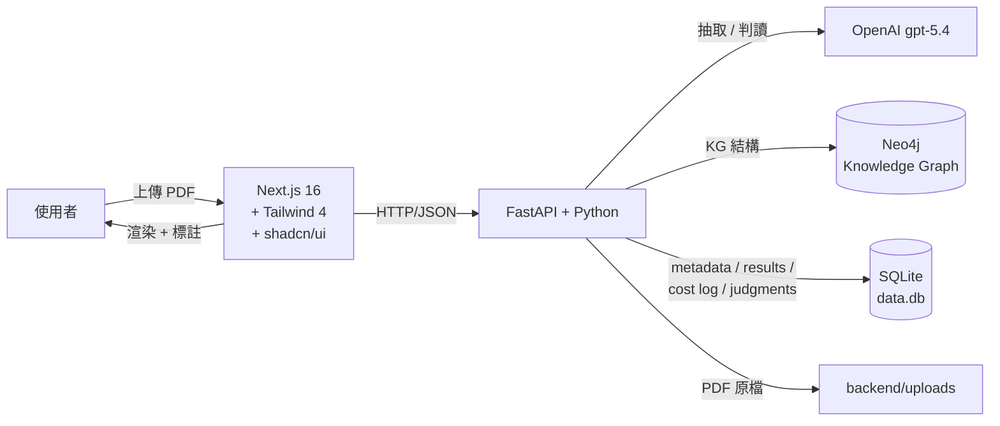
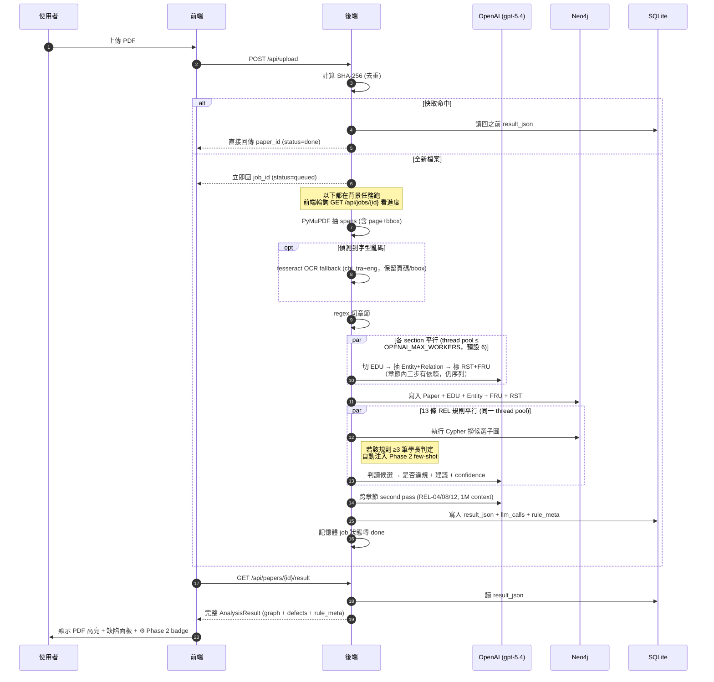
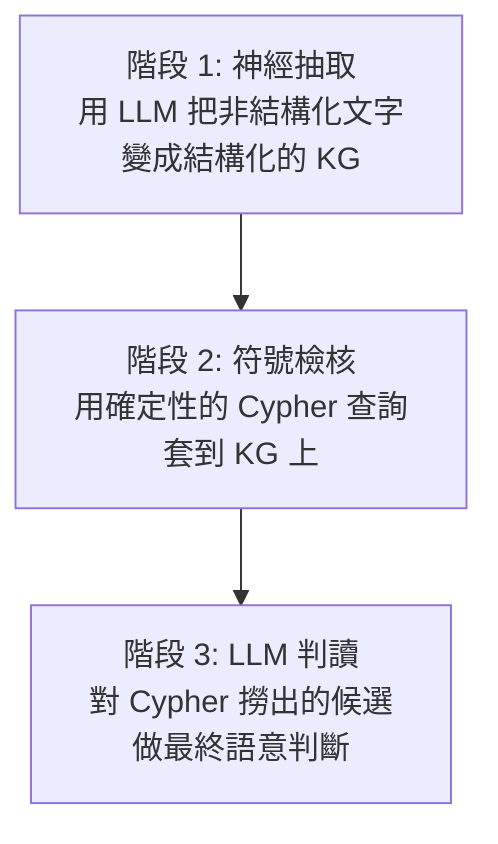
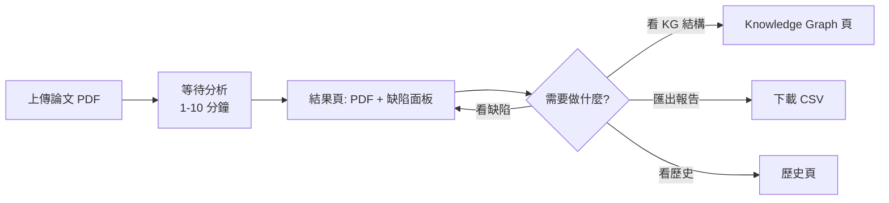
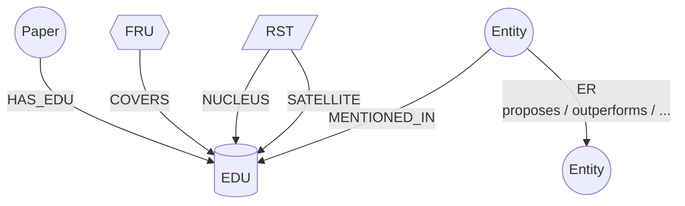
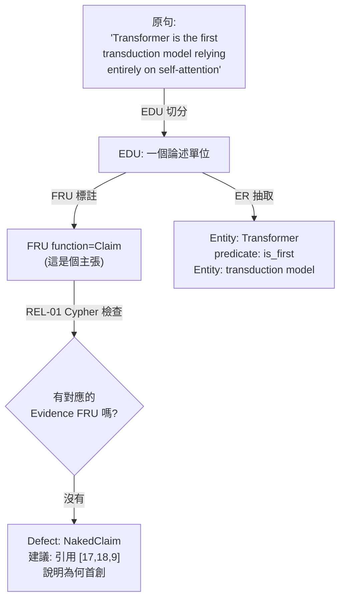

# 論文檢核系統 v3 — 系統說明文件

> 本文件是給研究團隊與後續維護者看的設計說明，包含系統目的、技術架構、操作方式、知識圖譜語意，以及未來方向。

---

## 1. 系統目的

學術論文初稿常見三類「結構性」問題：

1. **主張無證據** — 寫了「我們的方法效果最好」但沒提供數據或對照
2. **缺乏動機** — 直接給方法但沒說明為什麼這個問題重要
3. **跨章節失聯** — Conclusion 講的東西 Introduction 沒鋪陳，或方法沒對應問題

這些問題傳統上靠人工 review 抓，慢且主觀。本系統的目標是：

> 上傳一篇論文 → 自動找出邏輯結構性缺陷 → 給出修改建議

我們不做 grammar 檢查（已有 Grammarly 等工具），不做引用格式檢查（已有 Zotero 等），**只專注在論證結構與邏輯**。

### 跟「直接問 ChatGPT 幫我改論文」差在哪？

| | 純 LLM 對話 | 本系統 |
|---|---|---|
| 結果可重現 | ❌ 每次答案不同 | ✅ KG + 規則確定性 |
| 能追溯到原文位置 | ❌ 描述模糊 | ✅ 高亮 PDF 上具體句子 |
| 規則可由人維護 | ❌ 黑盒 | ✅ 規則寫在 YAML，學長可改 |
| 跨論文比較 | ❌ | ✅ KG 持久化於 Neo4j |
| 投論文有方法論支撐 | ❌ | ✅ Symbolic + Neural 結合（見參考文獻） |

---

## 2. 功能說明

| 功能 | 說明 |
|---|---|
| **PDF / TXT 上傳** | 支援中英論文，PDF 會以 PyMuPDF 抽取文字並保留座標 |
| **進度回報** | 上傳後即時顯示「抽 EDU → 抽 ER → 標 RST/FRU → 規則檢核」進度 |
| **缺陷檢測** | 自動套用 13 條 REL 規則，列出嚴重度（高/中/低）與所屬章節 |
| **修改建議** | 每個缺陷附原文證據句、缺陷說明、與具體修改方向 |
| **PDF 視覺化** | 點缺陷 → PDF 自動 scroll + 高亮對應段落；點 PDF 高亮 → 反向選缺陷 |
| **Knowledge Graph 視覺化** | 用 React Flow 渲染論文的 Entity 圖與 FRU 修辭結構圖 |
| **CSV 報告匯出** | 類似資安弱掃報告，含原文、嚴重度、建議，可給指導老師 |
| **上傳快取** | 同一份檔案再次上傳秒回，不重新呼叫 LLM（永久有效，重啟後仍生效） |
| **歷史頁** | 列出所有分析過的論文（SQLite 持久化），支援多選批次刪除（同步清 Neo4j + PDF） |
| **學長判定 (Human-as-judge)** | 每個缺陷三個按鈕（✅判對 / 🤔部分對 / ❌誤判），即時存 SQLite。**Phase 2 已啟用**：≥3 筆判定後自動 inject 為 LLM few-shot calibration（見 §3.6） |
| **論文助手聊天** | 右下角浮動抽屜，限定本篇 scope，強制 cite `[EDU:xxx]` / `[DEFECT:xxx]`（可點擊跳 PDF）；Guardrails 含 prompt-injection 偵測 + rate limit 15/min |
| **規則統計頁 `/stats`** | 13 條規則跨論文命中率、precision、Phase 2 樣本充足度，狀態 badge（🌑 從未觸發 / ⚠️ 需檢討 / ✅ 表現良好 / 🔥 高頻） |
| **跨章節 second pass** | 每篇分析另跑 gpt-5.4 1M 全篇掃 REL-04/08/12（per-section 抓不到的） |
| **LLM Confidence 分數** | 每個 defect 帶 0–1 信心分，前端用色塊顯示 |
| **Prompt 集中化** | 所有 system prompt 在 `backend/prompts/*.md`，學長改不用碰 Python |
| **成本即時顯示** | 結果頁 header 標 `$X.XXX`，全域 `/api/cost` 統計每階段花費 |

---

## 3. 技術說明

### 3.1 整體架構



### 3.2 處理流程（時序圖）

> 2026-05-25 更新：文字抽取移到背景任務、PDF 字型亂碼走 OCR fallback、章節抽取與 13 條規則改 thread pool 平行、模型換成 OpenAI gpt-5.4 / gpt-5.4-mini。效能細節見 [§3.9](#39-效能平行化--規則瘦身)。



### 3.3 為什麼不直接全文丟給 LLM 找問題？

技術上 LLM 的 context 夠（gpt-5.4 容得下整篇論文），但這樣做有三個缺點：

1. **不可重現** — 同樣的論文跑兩次答案可能不同，沒法做學術 evaluation
2. **沒有結構支撐** — LLM 隨意輸出哪邊有問題，無法保證涵蓋所有規則
3. **論文賣點消失** — 學長要強調的是「**Symbolic 約束 LLM**」，不是「LLM 自由發揮」

所以採用**先建結構、再規則檢核**的兩階段做法：



這對應學界正在發展的 **Neurosymbolic AI**（神經 + 符號）方向（Garcez & Lamb, 2023；Pan et al., 2024）。

### 3.4 技術棧

| 層 | 技術 |
|---|---|
| 前端 | Next.js 16 (App Router) · React 19 · TypeScript · Tailwind CSS 4 · shadcn/ui · React Flow · react-pdf · sonner |
| 後端 | Python 3.11+ · FastAPI · Pydantic v2 · PyMuPDF · rapidfuzz |
| LLM | OpenAI API（gpt-5.4 heavy / gpt-5.4-mini light / gpt-5.4 cross-section）；`OPENAI_BASE_URL` 可指向 Azure / 自架 proxy / vLLM。早期版本用 Anthropic Claude，已於 `feat/openai-deploy` 遷移 |
| 知識圖譜 | Neo4j 5.26 (Community) · Cypher · neo4j Python driver |
| 持久化 | SQLite (stdlib `sqlite3`)：metadata、results、hash 快取、LLM 成本 log、人工判定 |
| 容器化 | Docker Compose（本機只起 Neo4j；生產為 neo4j+backend+frontend+caddy 整套單一 port，見 [DEPLOY.md](../DEPLOY.md)） |

### 3.5 資料持久化分工

三個層各管一塊，**不重疊**：

| 儲存層 | 內容 | 重啟後 |
|---|---|---|
| **Neo4j** | 五種節點與邊（`Paper / EDU / Entity / FRU / RST` + 邊）— 用於 Cypher 候選查詢 | 持久（Docker volume） |
| **SQLite** (`backend/data.db`) | `papers`（含 content_hash、pdf_path）· `results`（完整 JSON）· `llm_calls`（每次呼叫的 token / cost）· `defect_judgments`（學長 ✅/🤔/❌ 標註） | 持久 |
| **本地磁碟** (`backend/uploads/`) | PDF 原檔，檔名以 `paper_id` 為 key | 持久 |
| In-memory `_jobs` dict | 分析中的 job 進度（`queued`/`extracting`/`checking`） | 重啟丟失（無關緊要） |

設計準則：
- **結構性資料進 Neo4j**（給 Cypher 用）
- **流水/分析資料進 SQLite**（給統計、cache、評估用）
- **二進位檔案進磁碟**（給 frontend 拉回顯示）

### 3.6 回饋迴路狀態（capture 端已閉、inject 端目前為 zero-shot）

> ⚠️ 2026-07-02 校正：本節原描述「Phase 2 few-shot 已閉合、實作在 `db.get_judgment_examples` / `rules._build_examples_block`」與程式碼不符——**這兩個函式在現行 codebase 不存在**，`check_rule` 未注入任何 few-shot。實況以 [REL-rules-explained.md §8](REL-rules-explained.md) 為準：3.5 版起已移除 few-shot 注入迴路，規則檢核**一律 zero-shot**。以下為現況。

迴路的**擷取端**仍在：per-section verdict 會帶 confidence 與 rule_meta，前端可手動標 ✅ 判對 / 🤔 存疑 / ❌ 誤判，存進 SQLite `defect_judgments`，並以 `/api/judgments/summary` 算 per-rule precision。

```mermaid
flowchart LR
    A[新論文] --> B[Cypher 撈候選]
    B --> D[LLM 判讀 zero-shot]
    D --> G[Defect 清單<br/>+ confidence + rule_meta]
    G -.手動標 ✅/🤔/❌.-> H[(SQLite<br/>defect_judgments)]
    H --> I[/api/judgments/summary<br/>per-rule precision（離線分析）]
```

**目前尚未做**的是把這些判定回注 prompt（線上 few-shot）。規則精準度校準走**離線分析**，不在檢核當下 inject。若要重新啟用 few-shot 迴路，需新實作 `db.get_judgment_examples` 與 `check_rule` 的範例注入——見 [TODO.md 待辦 7](TODO.md)（規則回饋校準，Phase 2 迴路程式尚未就緒）。

### 3.7 跨章節 second pass

13 條規則中，**REL-04 / REL-08 / REL-12** 本質需要跨章節推理（例如 Conclusion 的 restatement vs Introduction 的 claim），per-section Cypher 抓不到。

從 2026-05-10 起，每篇分析在 13 條規則跑完後會額外做一次 [cross_section_pass](../backend/app/rules.py)：
- 模型：`model_cross_section()`，由 `OPENAI_MODEL_CROSS_SECTION` 設定（目前 `gpt-5.4`，1M context）
- 輸入：整篇 EDU 依 section 排好 + 三條規則描述
- Schema 強制 `evidence_edu_ids ≥ 2`（必須引跨章節證據）
- 缺陷類型加「（跨章節）」字樣與 per-section 結果區分
- 預設開啟，`ENABLE_CROSS_SECTION_PASS=0` 可關掉
- **失敗容忍**：cross-section pass throw 不會丟棄前面 13 條規則的結果，只記 warning（[routes.py](../backend/app/routes.py)）

成本：一篇 ~10K input tokens，量級約 $0.05-0.30（依當前 gpt-5.4 定價）。

### 3.8 Prompt 集中化

從 2026-05-10 起，所有 system prompt 抽到 [backend/prompts/](../backend/prompts/)（2026-07-02 校正：現有 16 個 md）：
- 檢核管線：`edu.md` `er.md` `rst_fru.md` `checker.md` `chat.md` `cross_section.md`
- 編輯器：`autocomplete.md` `rewrite.md` `outline.md` `citation_query.md` `citation_parse.md` `claim_verifier.md` `title.md` `translate.md`
- 消融實驗（離線）：`ablation_holistic.md` `ablation_structure.md`
- 載入器：[backend/app/prompts.py](../backend/app/prompts.py) `load_prompt(name)`（lru_cache，呼叫 `prompts.reload()` 可清快取）
- 學長改 prompt 重啟 backend 即生效，不用碰 Python
- Git diff 也能看到 prompt 演進史

### 3.9 效能：平行化 + 規則瘦身

> 狀態（2026-07-02 校正）：平行化**已合併 main 並上線**（`ThreadPoolExecutor` 見 `rules.py:213`、`pipeline.py:760`），`feat/parallel-pipeline` 分支已不存在。前端對應說明在 about 頁「11. 效能與穩定性」。

**為什麼原本很慢（~9 分鐘）**
一篇論文的分析會發出 ~30–40 次 LLM 呼叫（每章節 EDU→ER→RST/FRU 三次 × N 章節，加 13 條規則各一次，再加跨章節）。這些呼叫原本**一個接一個序列執行**，token 密集的中文段落單次就要 4–10 秒，整篇常常要 ~9 分鐘。瓶頸是「等待」而非「運算」——絕大多數時間花在等 OpenAI 回應。

**怎麼改（三件事）**
1. **平行化**（`pipeline.py` / `rules.py`）：章節之間、13 條規則之間本來就互相獨立，改用 `ThreadPoolExecutor`（`OPENAI_MAX_WORKERS`，預設 6）整批送出。
   - 章節內 EDU→ER→RST/FRU 仍序列（ER、RST 都吃 EDU，有依賴）；章節之間才平行。
   - 13 條規則直接整批平行——這是最大的單點收益。
   - `pool.map` **保留輸入順序** → 組出來的 graph / defects 仍 deterministic，可重現。
   - thread-safe：OpenAI client 與 Neo4j driver 是 process 級 singleton（double-checked locking，見下）、SQLite 每次開新連線、Neo4j 寫入排在平行區段之後才做；`call_with_tool` 也內建 429/5xx 指數退避。
2. **規則 verdict 瘦身**（`rules.py`）：原本 schema 強制每個候選都填 `description/suggestion/severity/...`，但 `check_rule` 只保留「違規」的候選、非違規直接丟掉——等於逼模型對一堆非違規候選寫了一大段沒用的中文。改成只有 `candidate_index + violates` 必填，細節欄位只在 `violates=true` 才填；`check_rule` 改防禦式讀取（欄位變 optional，缺 description 就跳過該筆）。
3. **thread-safe singleton**（`llm.py` / `kg.py`）：平行化後多執行緒會同時撞 `client()`/`driver()` 的 lazy init，改 double-checked locking（穩定後是 lockless 快路徑，只鎖一次性冷啟動）。

**改完的數據（同一篇論文）**

| 階段 | 原本（序列＋肥 schema） | 現在（平行＋瘦 schema） |
|---|---|---|
| build_paper_graph | ~246s | ~67s |
| check_all_rules | ~288s | ~26s |
| **合計** | **~538s（~9 分鐘）** | **~93s（~1.8 分鐘，約 5×）** |

拆解來看：
- 只做平行化（schema 還沒瘦）：534s → 182s（**2.9×**）。
- 再疊上規則瘦身：單條 REL-06 從 7069→1554 output token、101s→20s（同樣抓到 5 個違規）；check_all_rules 段整體再降到 ~26s，合計來到 **~5×**。

> 量測能成立是因為每次 LLM 呼叫的 stage / 模型 / token / 時間都寫進 SQLite `llm_calls`（見 [DB_SCHEMA.md](DB_SCHEMA.md)）。註：平行化後 `created_at` 間隔不再等於單次耗時，要精確 per-call 延遲需另記 `duration_ms`（TODO 待辦）。

---

## 4. 操作說明

### 4.1 啟動三個服務

需要三個 terminal：

**Terminal 1 — Neo4j：**（⚠️ 2026-07-02 校正：`docker compose up -d` 會起**全套三容器**〔neo4j+backend+frontend〕，且 backend 需 `backend/.env` 否則起不來；native dev 只要 Neo4j 時請用 `docker compose up -d neo4j`）
```bash
docker compose up -d neo4j
# Neo4j Browser: http://localhost:7474 (帳號 neo4j / 密碼 thesis_demo_pw)
```

**Terminal 2 — Backend：**
```bash
cd backend
source .venv/bin/activate
uvicorn main:app --reload --reload-dir app
# → http://localhost:8000
```

**Terminal 3 — Frontend：**
```bash
cd frontend
npm run dev
# → http://localhost:3000
```

### 4.2 使用流程



### 4.3 結果頁互動

- **點缺陷卡片** → PDF 自動跳到該頁，高亮對應段落
- **點 PDF 上的高亮** → 反向選中對應的缺陷
- **嚴重度顏色**：高 = 紅、中 = 橘、低 = 黃
- **下載 CSV** → 含原文 + 缺陷類型 + 建議的試算表（UTF-8 BOM，Excel 開繁中正常）

---

## 5. Knowledge Graph 語意說明

### 5.1 五種節點

| 節點 | 代表什麼 | 從哪來 |
|---|---|---|
| `Paper` | 論文本身 | 上傳時建立 |
| `EDU` | Elementary Discourse Unit，最小論述單位（一個子句、一個命題） | LLM 切分 |
| `Entity` | 概念實體（方法名、資料集、評估指標等） | LLM 抽取 |
| `FRU` | Functional Rhetorical Unit，由連續 EDU 組成的「修辭功能單元」 | LLM 標註 |
| `RST` | Rhetorical Structure 修辭關係（Nucleus + Satellite + 關係類型） | LLM 標註 |

### 5.2 六種邊

| 邊 | From → To | 意義 |
|---|---|---|
| `HAS_EDU` | Paper → EDU | 論文擁有的所有 EDU |
| `COVERS` | FRU → EDU | 一個 FRU 涵蓋哪幾個 EDU |
| `NUCLEUS` | RST → EDU | 修辭結構的核心 EDU |
| `SATELLITE` | RST → EDU | 修辭結構的衛星 EDU |
| `ER` | Entity → Entity | 兩個實體間的關係（如 proposes、outperforms） |
| `MENTIONED_IN` | Entity → EDU | 實體在哪個 EDU 裡被提到 |

### 5.3 KG Schema



### 5.4 13 條 REL 規則對應的 KG 模式

每條規則本質上是一個「**KG 上的 anti-pattern**」 — 找出符合特定結構的子圖，那就是缺陷候選。

| 規則 | KG 上要找什麼 |
|---|---|
| REL-01 Claim-Evidence | `FRU(function=Claim)` 但沒有對應的 `FRU(function=Evidence)` |
| REL-03 Action-Justification | `FRU(function=MethodStep)` 但沒有對應的 `Motivation` FRU |
| REL-09 Observation-Attribution | `FRU(function=Observation)` 但沒有 `Attribution` FRU 配對 |
| REL-10 Concession-Compensation | `FRU(function=Concession)` 但沒有 `Compensation` FRU |
| REL-12 Core-Restatement | Abstract / Conclusion EDU 文字相似度比對 |
| ...（其他 8 條） | 見 [backend/rules.yaml](../backend/rules.yaml) |

完整 13 條規則的 description 與 Cypher 候選查詢，請看 [backend/rules.yaml](../backend/rules.yaml)。這是學長 MECE 收斂自 51 條章節分層規則的成果。

### 5.5 一個具體例子

論文裡寫：

> 「To the best of our knowledge, the Transformer is the first transduction model relying entirely on self-attention.」

系統處理流程：



→ 缺陷面板出現「REL-01 NakedClaim」並指回原句。

---

## 6. 未來展望

### ✅ 已完成

- **後端 SQLite 持久化** — 重啟仍保留歷史與 hash 快取
- **Token / cost logger** — 每篇成本即時顯示，全域統計可查
- **Human-as-judge 標註介面** — 每個缺陷可標 ✅/🤔/❌，累積評估資料
- **Phase 2：Judgment → LLM Few-shot 回饋迴路**（2026-05-10）— ≥3 筆判定後自動 inject 為 calibration，閉合 §3.6 的迴路
- **Prompt 集中化** — 全部 system prompt 在 `backend/prompts/*.md`，學長改不用碰 Python
- **跨章節 second pass** — gpt-5.4 1M context 全篇掃 REL-04/08/12
- **LLM Confidence 分數** — 每個 defect 帶 0–1 信心分
- **規則統計頁 `/stats`** — 13 條規則跨論文命中率、precision、Phase 2 樣本充足度
- **論文助手聊天抽屜** — 限定本篇 scope + Guardrails（injection / rate limit / 強制 cite）
- **缺陷分組顯示 + hover 完整 evidence**
- **歷史頁批次刪除**（同步清 SQLite + Neo4j + PDF）
- **PDF OCR 容錯（v3.1.0）** — 字型亂碼自動轉 tesseract OCR，文字抽取移到背景任務
- **版本紀錄頁 + 三碼語意化版本** — `/changelog` 頁 + header 版本徽章
- **分析 pipeline 平行化 + 規則瘦身**（branch `feat/parallel-pipeline`，未合併）— ~9 分鐘 → ~1.8 分鐘（約 5×），見 [§3.9](#39-效能平行化--規則瘦身)
- **正式部署上線** — OpenAI 版部署於實驗室伺服器 `140.115.54.62:8083`（單一 port，Caddy 反代分流，見 [DEPLOY.md](../DEPLOY.md)）

### 短期（demo 後 1–2 週）

- **⭐ 學長累積 ~50 筆 judgments → Phase 2 ablation**（最高優先，論文 main result）
  - 標完跑 with vs without few-shot，預期 precision 上升 10-20%
  - 也順便解鎖 Pre-annotation 評估工具（需要 ≥50 筆才有意義）
- **Pre-annotation 評估工具 + per-rule F1**：把 SQLite judgments 當 ground truth，自動算 per-rule precision
- **規則迭代回饋迴路**：`/stats` 頁 precision < 0.5 自動標紅，提示學長改規則 description

### 中期（1 個月）

- **OpenAI Batch API**：跑大規模實驗時 50% 折扣（pipeline 需改 async）
- **Prompt 版本化**：每個 prompt 變更記到 SQLite + 跑回歸看 precision 變化
- **Inter-annotator agreement**：學長 + 你各標 5 篇 overlap，算 Cohen's kappa（強化論文方法章節）

### 長期（投論文前 — 老師說先不嘗試）

- **Hybrid Local + Cloud**：EDU/ER 用 Ollama (Qwen 2.5 32B/72B) 本地，RST/規則用雲端 gpt-5.4，成本降 60%
- **跨論文 Entity 對齊**：同一個 method 在多篇對齊，做引用網絡分析
- **Multi-agent (Claim/Evidence/Critic)**：拆 prompt 細分職責，但需要重設計 pipeline
- ~~**編輯模式 + 可 merge 缺失建議**~~：**已上線**（AI 寫作編輯器 v4.17，TipTap + Zustand，匯入 txt/md/docx/tex、缺陷一鍵套用 AI 修正、三格式匯出）。唯一剩下缺口＝PDF 匯入，見 [TODO.md 待辦 6](TODO.md)。

---

## 7. 參考文獻（理論支撐）

本系統的方法論基礎：

1. **Mann, W. C., & Thompson, S. A. (1988).** *Rhetorical Structure Theory: Toward a functional theory of text organization.* Text, 8(3), 243-281.
   → RST 修辭結構理論的奠基論文，本系統的 RST 標註層直接源自此

2. **Swales, J. M. (1990).** *Genre Analysis: English in Academic and Research Settings.* Cambridge University Press.
   → 提出 IMRD 學術論文結構與 CARS 動機模型，影響本系統 13 條規則的章節分層

3. **Carlson, L., Marcu, D., & Okurowski, M. E. (2001).** *Building a discourse-tagged corpus in the framework of Rhetorical Structure Theory.* Proceedings of the 2nd SIGdial Workshop.
   → RST Discourse Treebank（RST-DT），未來用作標註品質 benchmark 的金標準

4. **Pan, S., Luo, L., Wang, Y., Chen, C., Wang, J., & Wu, X. (2024).** *Unifying Large Language Models and Knowledge Graphs: A Roadmap.* IEEE Transactions on Knowledge and Data Engineering.
   → 統整 LLM + KG 的最新研究方向，本系統「KG 約束 LLM」的設計符合該 roadmap 的 LLM-augmented KGs 範式

5. **Garcez, A. d., & Lamb, L. C. (2023).** *Neurosymbolic AI: The 3rd Wave.* Artificial Intelligence Review, 56, 12387-12406.
   → 神經 + 符號結合的方法論依據

6. **志祥學長（2025+，內部研究）** — 13 條 REL 全域通用規則的 MECE 收斂方法（從 51 條章節分層規則合併），尚未發表

---

## 8. 名詞速查

| 縮寫 | 全稱 | 一句話解釋 |
|---|---|---|
| EDU | Elementary Discourse Unit | 最小論述單位，通常是一個子句 |
| ER | Entity-Relation | 實體與實體間的關係（三元組） |
| RST | Rhetorical Structure Theory | 修辭結構理論，描述子句間的功能關係 |
| FRU | Functional Rhetorical Unit | 功能修辭單元，由連續 EDU 組成的「這段在幹嘛」單位 |
| KG | Knowledge Graph | 知識圖譜，由節點與邊組成的結構化知識 |
| MECE | Mutually Exclusive, Collectively Exhaustive | 互斥且窮盡，麥肯錫的分類原則 |
| REL | Rule | 本系統 13 條規則的命名前綴（REL-01 ~ REL-13） |
| LLM | Large Language Model | 大型語言模型（目前用 OpenAI gpt-5.4） |

---

## 9. 範例：對中文社科碩論的分析

以下是手動模擬系統對一份 2019 長庚大學資管所碩士論文（主題：心流與使用滿足對 Instagram 持續使用意圖的影響，量化問卷研究）的判讀，示範 13 條 REL 規則在**社科量化論文**這個 domain 上的觸發樣態。

### 觸發的缺陷（8 個）

#### REL-08 ProblemSolutionMismatch · **高嚴重** · Intro vs Results

§1.2 提出三個研究問題。但 §4.4.3 結果：H1 的 5 條子假說只有 1 條成立。研究問題 1（影響持續使用意圖的動機為何？）等於沒被直接回答 — 預測的 4 個動機沒有直接影響持續使用意圖（雖然透過心流間接影響）。

**建議**：在 Intro 末或 Discussion 開頭明確重新框架「直接 vs 間接效果」的差異。

#### REL-01 NakedClaim · **中嚴重** · Introduction

> 「Instagram 是一個進步快速的社群媒體平台，近年來增加了大量使用者 (Sheldon et al., 2017)」

僅引用一篇關於克羅埃西亞的跨文化研究就推論到「台灣勢必有一席之地」。從異國研究跳到本地場景缺乏直接證據。

#### REL-03 MissingMotivation · **中嚴重** · Method

「在台灣居住時數 5 年到 10 年…其餘 5 年以下的居住年限，本研究判定為無效問卷。」**為什麼是 5 年**？沒有說明。這是 inclusion criteria 的核心，需要 motivation。

#### REL-09 ObservationWithoutAttribution · **中嚴重** · Discussion

4 條 H1 假說被拒，事後歸因為「使用後達到滿足立即關掉」— 但研究**未測量**使用後行為，只引一篇 Guo et al. 支撐。post-hoc speculation 須明確標記。

#### REL-09 ObservationWithoutAttribution · **中嚴重** · Discussion

H3-2（自我呈現）失敗的歸因再次依賴單一引用 + 後設解釋。質性訪談（MD006）反而支持自我呈現很重要，量化與質性結果衝突沒被處理。

#### REL-12 ConclusionMisaligned · **中嚴重** · Abstract vs Results

Abstract 寫「使用動機及持續使用意圖均有受到心流之影響」— 口吻比資料支持的更樂觀，沒提到 4/5 直接路徑都不顯著。

#### REL-02 BaselineNotCritiqued · **低嚴重** · Literature Review

引用 Bhattacherjee (2001) ECM 但沒做為 baseline 比較，沒解釋為何不用 ECM 而用 SOR + 使用與滿足。

#### REL-10 UncompensatedConcession · **低嚴重** · Limitations

§5.2 限制三條，沒提到「橫斷面設計無法證明因果」這個量化研究最大限制 — 但全文用「影響」一詞論述。

### 沒觸發或表現好的規則

| 規則 | 為什麼沒觸發 |
|---|---|
| REL-04 Macro-Decomposition | Intro 有清楚的問題拆解 |
| REL-05 Process-Sequence | Method 步驟清楚（深訪 → 前測 → 正式問卷）|
| REL-06 Concept-Formalization | 每個 construct 都有概念型定義表 |
| REL-07 Setup-Scoping | 樣本/工具/時程詳述 |
| REL-11 Specific-Generalization | 質性個案 → 量化驗證設計平衡 |
| REL-13 Meta-Discourse | 章節導引充足 |

### 從這個範例看到的 v3 系統限制

跑這次模擬讓我發現幾個未來要強化的方向：

1. **Domain-specific rule packs**：量化社科論文的失準型態（假說大量失敗 → 後設解釋）跟 NLP/CS 論文（Transformer 那種）很不同。`rules.yaml` 未來應分 domain 變體。
2. **跨章節對齊（REL-08, REL-12）是高價值規則**，但目前 Cypher 候選太弱（只比文字相似度）— 這是「whole-paper second pass」優先要補強的部分。
3. **Post-hoc speculation 偵測**（REL-09 變體）— 量化研究最常見的學術瑕疵，但目前規則描述偏一般化，可以針對「假說失敗 + 單一引用解釋」這個 pattern 強化 Cypher。

---

## 10. 工程經驗紀錄（已踩過的坑）

> 此區記錄迭代過程中得到的非顯而易見決策，避免後人重踩。

### 10.1 模型選擇：Opus → Sonnet → Sonnet+Haiku → Sonnet（最終）

跑了三輪實驗：

| 配置 | EDU 數（同一篇） | 缺陷數 | 單篇成本 | 結果 |
|---|---|---|---|---|
| Opus heavy + Sonnet light | 311 | 4 | ~$3 | 品質感覺好但成本高 |
| Sonnet heavy + Haiku light | **194** ↓38% | 16 | ~$0.4 | EDU 粒度違反定義 — 拒絕 |
| **Sonnet heavy + Sonnet light** | ~300 | TBD | ~$0.55 | 採用 |

**關鍵教訓**：
- **EDU 切分不能省**。Haiku 把多個命題合成一個 EDU，違反 "elementary" 定義，會 cascade 弄壞下游所有 FRU/RST 標註。
- **規則判讀 Sonnet 比 Opus 更積極**（同候選輸出更多 verdict=violates）。沒有 ground truth 時不能說誰對，但實作上應該配合 Human-as-judge 累積資料再決定。
- **不要為了「看起來省錢」就把每階段都用最便宜的模型** — 結構性步驟出錯成本不可逆。

### 10.2 規則迭代：REL-09 從「全篇 boolean」改 proximity 檢查

原版 Cypher 的 `WHERE NOT EXISTS { MATCH (a:FRU {function: 'Attribution'}) }` 實際語意是「全文有沒有任何 Attribution」。導致：

- 全篇 0 個 Attribution → **所有** Observation 全被丟給 LLM 判
- 全篇 1 個 Attribution → **沒有任何** Observation 被丟出（明顯錯）

改成「同章節、order 鄰近 [obs_start - 3, obs_end + 8] 內檢查」，外加 description 加保守原則指令。預期 false positive 從 ~12 降到 ~5。

**通則**：每條 REL 規則的 Cypher 都要回答「同篇內、哪個範圍內」是合理的搜尋邊界，不是 paper-wide boolean。

### 10.3 Human-as-judge 的迴路（擷取端已閉、注入端目前 zero-shot）

> ⚠️ 2026-07-02 校正：本節原稱「2026-05-10 起 Phase 2 已閉合、自動注入 few-shot」與程式碼不符（注入用的函式不存在）。實況：3.5 版**移除了 few-shot 注入迴路**，規則檢核一律 zero-shot，判定只進 SQLite 供離線 precision 統計。詳見 §3.6 與 [REL-rules-explained.md §8](REL-rules-explained.md)。

判定 UI 的價值目前在**離線分析**：學長標的 ✅/🤔/❌ 存進 `defect_judgments`，`/api/judgments/summary` 算 per-rule precision，用來人工判斷哪條規則要改 description。**LLM 檢核當下不會讀這些判定**——「按一按就會自動學習」是尚未實作的功能，別誤以為已在線上生效。

**若未來要重啟 few-shot 迴路**，當初設計過的注入閾值（尚未落地，供參）：< 3 筆不注入（樣本太少易 over-fit）、3-8 筆取最新、> 8 筆改 representative sampling。

### 10.4 跨章節推理需要 1M context

REL-04 (Macro-Decomposition) / REL-08 (Problem-Solution) / REL-12 (Core-Restatement) 本質要對比兩個以上章節：
- 「Conclusion 的 restatement 跟 Introduction 的 claim 是否一致？」
- 「Method 拆解是否真的對應 Introduction 的問題？」

per-section Cypher 抓不到這個（candidates 只能看一個 section 的子圖）。早期只在 per-section 模式跑這三條規則，經常 0 hit 或漏判。

加了 [cross_section_pass](../backend/app/rules.py)（gpt-5.4 1M context）一次掃整篇後，這三條的命中質量明顯改善。Schema 強制 `evidence_edu_ids ≥ 2`，要求 LLM 必須引兩個以上 EDU 才能 emit 缺陷，避免它退化成 per-section 抓法。

**通則**：跨章節規則要獨立的 prompt + 模型分配，不能塞在 per-section 流程裡。

### 10.5 Prompt 集中化的時機點

最初 prompt 散在 `pipeline.py` / `rules.py` / `chat.py` 各處。一開始這樣 OK，因為 prompt 還在迭代。但當：
1. 開始有 5+ 個 prompt
2. 學長想自己改 prompt 但不寫 Python
3. 開始想做 prompt 版本化 / A/B 測試

…就應該抽到 markdown。實作 [backend/app/prompts.py](../backend/app/prompts.py) 用 `lru_cache` + `reload()`，學長改完 .md 重啟 backend 即生效。Git diff 也能單獨追 prompt 演進。

### 10.6 SQLite vs in-memory dict — 看似能延後的 refactor 其實阻擋很多事

最初 `_paper_results / _hash_to_paper_id / _paper_files` 都用 in-memory dict，一切看起來「dev 階段先這樣」。但很快遇到三個問題同時湧現：
1. 重啟丟失分析結果，每次都要重跑（昂貴）
2. Hash 快取失效，無法做永久去重
3. 沒地方存 cost log → 沒辦法回答「這篇花多少錢」

加 SQLite 後三件事一次解掉，且為 Human-as-judge 留好桌位（`defect_judgments` 表）。**結論：當 in-memory state 開始綁定 user-visible 行為時，立刻換 SQLite，不要拖。**

---

## 11. SQL / DBeaver 查詢手冊

backend 跑著時，可以另外用 DBeaver 或 `sqlite3` CLI 查 `backend/data.db`（SQLite 支援多 reader 並發，**只 SELECT 不會打架**）。

### 11.1 連線（DBeaver Community）

1. `brew install --cask dbeaver-community`（或從 [dbeaver.io](https://dbeaver.io/download/) 下載）
2. New Database Connection → 選 **SQLite**
3. Path 填：`<repo>/backend/data.db`
4. 第一次會問 Download SQLite JDBC driver → 按下載
5. Test Connection → Finish

### 11.2 常用查詢（複製即用）

**看哪條規則最爛（per-rule precision）**

```sql
SELECT rule_id,
       COUNT(*) AS total,
       SUM(verdict='correct') AS correct,
       SUM(verdict='partial') AS partial,
       SUM(verdict='wrong')   AS wrong,
       ROUND((SUM(verdict='correct') + 0.5*SUM(verdict='partial')) * 1.0
             / COUNT(*), 2) AS precision
FROM defect_judgments
GROUP BY rule_id
ORDER BY precision ASC;   -- 最爛的排前面
```

**看每篇論文的 LLM 成本**

```sql
SELECT paper_id,
       COUNT(*) AS calls,
       ROUND(SUM(cost_usd), 4) AS cost_usd,
       SUM(input_tokens) AS in_tok,
       SUM(output_tokens) AS out_tok
FROM llm_calls
GROUP BY paper_id
ORDER BY cost_usd DESC;
```

**看哪個階段最貴（rule_check / edu / er / rst_fru）**

```sql
SELECT stage,
       COUNT(*) AS calls,
       ROUND(SUM(cost_usd), 4) AS cost_usd
FROM llm_calls
GROUP BY stage
ORDER BY cost_usd DESC
LIMIT 10;
```

**從 results JSON 抽 metadata**

```sql
SELECT json_extract(result_json, '$.paper_id') AS paper_id,
       json_extract(result_json, '$.graph.title') AS title,
       json_array_length(result_json, '$.graph.edus') AS edu_count,
       json_array_length(result_json, '$.defects')   AS defect_count
FROM results;
```

**找「燒錢但判錯多」的規則**（最該優先改）

```sql
SELECT j.rule_id,
       COUNT(j.defect_id) AS judged,
       SUM(j.verdict='wrong') AS wrong,
       ROUND(SUM(c.cost_usd), 4) AS total_cost_usd
FROM defect_judgments j
LEFT JOIN llm_calls c
    ON c.paper_id = j.paper_id
   AND c.stage = 'rule_check:' || j.rule_id
GROUP BY j.rule_id
ORDER BY wrong DESC, total_cost_usd DESC;
```

### 11.3 安全性

- ✅ **SELECT 隨便跑** — SQLite 多 reader 並發 OK
- ⚠️ **避免 UPDATE / DELETE / INSERT** — DBeaver 預設交易模式可能 hold lock，跟 backend 寫入打架。要改的話先 `Ctrl+C` 停 backend
- 想開更好的並發模式：DBeaver 連線 properties 加 `journal_mode = WAL`（停 backend 改一次後永久生效）

### 11.4 等價的 HTTP API（不想開 SQL 也行）

| 等價 SQL | API |
|---|---|
| 全域 per-rule precision | `GET /api/judgments/summary` |
| 單篇所有判定 | `GET /api/papers/{id}/judgments` |
| 全域成本 | `GET /api/cost` |
| 單篇成本 | `GET /api/papers/{id}/cost` |
| 論文清單 | `GET /api/papers` |

---

*文件版本：v3（2026-05-09）*
*維護者：實驗室 thesis-llm 團隊*
