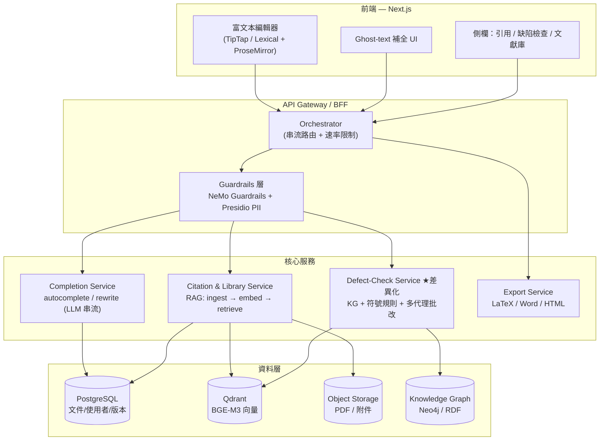

# 學術論文編輯器：市場調查與系統設計

> 目的：拆解 Jenni AI 與主要競品的功能與商業模式，找出市場缺口，並提出一個可落地的系統設計。
> 設計取向：對接 WIDM Lab 已驗證的元件（BGE-M3 + Qdrant、NeMo Guardrails、Presidio、KG + 符號規則 + 多代理批改），把差異化定位在「不只寫得快，而是寫得對」。
> 註：所有定價與功能會隨時間變動，本文資料以 2025 下半年至 2026 初的公開資料為準，採購前請以官網為準。

---

## Part 1 — 市場價值鏈：先看「論文寫作」被切成幾段

理解這個市場的關鍵，是把研究生產出論文的流程拆成六個階段。每個工具都在搶其中一段或幾段，沒有一家真正通吃。

| 階段 | 核心痛點 | 主導工具 |
|---|---|---|
| ① 文獻發現 | 找到相關、可信的論文 | Elicit、Consensus、Connected Papers、Research Rabbit、SciSpace |
| ② 閱讀理解 | 讀懂密集的英文論文、快速抓重點 | SciSpace（Chat PDF）、Paperpal、SciSummary |
| ③ 草稿 / 寫作 | 克服寫作障礙、維持邏輯連貫 | **Jenni AI**、Paperpal、SciSpace Copilot |
| ④ 引用管理 | 正確插入引用、切換格式 | Jenni、Paperpal、Zotero/Mendeley（傳統） |
| ⑤ 語言潤飾 / 投稿前檢查 | 學術英文地道度、期刊規範 | **Writefull**、**Trinka**、Paperpal、Grammarly |
| ⑥ 學術誠信 / 查重 | 抄襲比對、AI 偵測 | Turnitin、Paperpal（查重）、各家附加功能 |

**戰略觀察**：
- **Jenni 主攻 ③④**，是「共筆編輯器」流派。
- **Writefull / Trinka 主攻 ⑤**，是「投稿前語言守門員」流派。
- **SciSpace 從 ① 一路往 ③ 擴張**，2025 走向 agent 化，企圖通吃。
- **Paperpal 從 ⑤ 往兩端擴張**，主打「投稿就緒（submission-ready）」一站式。
- 真正沒人做好的，是把 **⑥ 的精神（正確性 / 缺陷檢查）前移到 ③ 的寫作當下**——這正是你的機會（見 Part 4）。

---

## Part 2 — Jenni AI 完整功能拆解

### 定位
Jenni 把自己定位成長文寫作的「共筆環境（co-writing environment）」，不是一鍵生成整篇文章的工具，而是邊寫邊補句、補段落、發展想法的協作夥伴。它的賣點是把「文字處理器 + ChatGPT + 文獻管理」整併進同一個編輯器。

### 核心功能模組

**A. 寫作輔助**
- **AI Autocomplete（逐句自動補全）**：核心功能，邊打字邊給出符合上下文與學術語氣的續寫建議。
- **AI Edit / Rewrite（改寫）**：選取文字後改寫、擴寫、調整語氣。
- **AI Chat**：與文件 / 文獻對話的助手。
- **Outline / 結構生成**：依研究問題產生標準論文章節骨架（並會依提示詳細度給評分）。

**B. 引用與文獻**
- **引用插入**：宣稱支援 1,700+ 引用格式，涵蓋 APA 7、MLA 9、Chicago、Harvard、IEEE，可在 Document Settings 或參考清單選單切換格式。
- **研究資料庫（Library）**：可上傳 PDF、BibTeX，或用 DOI / PMID 匯入文獻。
- **PDF-grounded chat**：對上傳的 PDF 做來源感知的問答與寫作。

**C. 匯出**
- 支援匯出為 **LaTeX、Word、HTML**，貼合學術工作流。

### 已知限制（這些是你做差異化的破口）
- **檔案硬限制**：每個檔案需小於 **15MB、150 頁**，不分方案——對長報告或掃描 PDF 是痛點。
- **引用準確度疑慮**：多份評論指出 Jenni 在引用正確性與「保留原創性」上有疑慮，學術寫作品質常被拿來和 Paperpal 這類學術專用工具比較而落下風。
- **免費版很緊**：免費方案每天約 200 字 AI 額度、10 次 PDF 上傳、10 則 AI 對話、僅部分匯出，實測幾分鐘就會用完。

### 定價（2025 下半年公開資料，會變動）
- **Free**：每天 ~200 AI 字數、功能受限。
- **Unlimited**：年繳約 **US$12/月**（總額約 US$144/年）；月繳約 **US$20–30/月**（不同來源報價落差大，採購前以官網為準）。
- **Team & Institutional**：客製報價，含多席次折扣、專屬支援、使用分析。

---

## Part 3 — 競品矩陣：學生常用的論文編輯器

### 3.1 直接競品（寫作 / 潤飾類）

**Paperpal — 學術專用、投稿就緒**
- 定位：以 22–23 年 STM（科學/技術/醫學）出版經驗訓練的學術寫作工具，主打「投稿就緒檢查」。其 AI 已內建學術語境，不需要你提示「請扮演期刊編輯」。
- 功能：即時語言建議、改寫、學術翻譯、查重（比對 1000 億網頁，免費每月 7,000 字、Prime 10,000 字）、投稿前檢查。
- 定價：Prime 約 **US$25/月、US$55/季、US$139/年**；Teams 方案 2–5 人約 US$107 起。
- 護城河：學術語料訓練 + 一站式「寫作→語言→投稿」流程。

**SciSpace（前身 Typeset）— 文獻發現到寫作的 all-in-one**
- 定位：從文獻搜尋、Chat PDF 閱讀理解，一路擴張到寫作（Copilot）。
- 功能：AI 推薦論文、論文摘要與重點標註、依期刊規範排版、Chrome 擴充、自動把論文資料抽取成比較表格。
- 演進：2025/02 推出 **Deep Review**（高階文獻搜尋）、2025/07 推出 **agent 能力**——明顯往 agentic research 走。
- 定價：免費方案；付費約 Premium **US$12/月**、Teams **US$8/月**（依來源，會變動）。

**Writefull — LaTeX / 投稿前語言守門員**
- 定位：被 Digital Science 收購，與 **Overleaf 同集團並原生整合**（不需裝擴充，直接在 Overleaf 編輯器內使用）。
- 功能：語言模型「只用已發表期刊論文與語言學分析訓練、不拿使用者投稿做訓練」，提供貼合學術標準的語言回饋；專屬 widgets：Academizer（口語轉學術）、Paraphraser（三段改寫強度）、Title/Abstract Generator；**TeXGPT** 可在 Overleaf 內直接生成表格與公式的 LaTeX 程式碼。
- 五大產品線：Word、Overleaf、Revise（上傳文件 + Track Changes）、Cite、X（網頁 widget hub）。
- 採用度：宣稱 1,500+ 機構採用（含 Stanford、Oxford、Tokyo），多家出版社信任。
- 護城河：**LaTeX 原生 + 純學術語料 + 不拿你的稿子訓練的隱私承諾**。對理工博班是殺手級。

**Trinka — 學術文法 + 期刊規範**
- 定位：針對學術與技術寫作的文法檢查，特別強在 LaTeX 文法檢查。
- 功能：可依 APA、AMA、AGU、ACS、IEEE 等期刊風格客製建議、依學科領域調整；非與 Overleaf 直接整合，但可上傳 Overleaf 匯出的最終檔做自動校對。

**QuillBot / Grammarly — 通用型**
- QuillBot：強在彈性改寫（paraphrasing）、摘要、引用產生器、查重（付費）。
- Grammarly：無所不在 + 日常寫作的打磨度高，但學術引用與規範不是強項。

### 3.2 上游競品（文獻發現 / 閱讀類）
Elicit、Consensus、Connected Papers、Research Rabbit、Paperguide、SciSummary——這些主攻 ①②，是 SciSpace 的對手，但對「編輯器」型產品而言是潛在整合來源而非正面競爭。Paperguide 近期以較低價提供與 SciSpace 相當功能、並強化 AI Writer，值得關注。

### 3.3 一張表看完

| 工具 | 主戰場 | 殺手鐧 | 弱點 | 約略定價（會變） |
|---|---|---|---|---|
| **Jenni AI** | ③ 寫作 + ④ 引用 | 逐句 autocomplete、1700+ 引用格式、PDF chat | 引用準確度、檔案 15MB/150頁限制 | Free / ~US$12（年）|
| **Paperpal** | ⑤ 潤飾 + 投稿就緒 | STM 語料、查重、一站式 | 價格偏高 | ~US$25/月、US$139/年 |
| **SciSpace** | ①→③ all-in-one | Deep Review、agent、Chat PDF | 功能廣但深度與穩定度待加強 | Free / ~US$12/月 |
| **Writefull** | ⑤ + LaTeX | Overleaf 原生、純學術語料、TeXGPT | 偏潤飾、非完整寫作環境 | Free / Premium |
| **Trinka** | ⑤ 文法 | 多期刊風格、學科客製 | 非即時協作編輯器 | Free / Premium |
| **Grammarly/QuillBot** | 通用 | 普及、改寫彈性 | 非學術專用 | Free / Pro |

---

## Part 4 — 市場洞察與機會缺口

### 趨勢
1. **Agent 化**：SciSpace 2025/07 上 agent、2025/02 上 Deep Review；市場正從「補句子」走向「幫你跑完一段研究工作流」。這和你的 Browser Agent / 企業 AI 研究方向高度重疊。
2. **投稿就緒一站式**：Paperpal 的「submission-ready」敘事正在贏得學術使用者——大家要的不是更會寫，而是更快投得出去。
3. **隱私與訓練資料成為賣點**：Writefull 強調「不拿你的稿子訓練」、模型只用已發表論文。這在學術圈是真實顧慮，也是可防守的差異化。
4. **學術誠信的張力**：一邊是 AI 生成、一邊是 AI 偵測（Turnitin），產品必須在「協助」與「代寫」之間劃清界線，否則機構不敢採用。

### 三個沒被填滿的缺口

**缺口 A — 正確性前移（你的主場）**
所有現有工具都在「寫得快 / 寫得地道」上競爭，幾乎沒有人在寫作當下做**論文缺陷檢查**：論點與證據是否對齊、引用是否真的支持該主張、方法與結論是否一致、章節邏輯是否斷裂。這正是你 WIDM Lab「論文檢核系統 / Thesis Critic」（KG + 符號規則 + 多代理 LLM）的能力。把它從「事後批改」變成「寫作當下的即時守門員」，是一個沒人佔據的定位。

**缺口 B — 繁體中文 / 台灣學術場景**
主流工具幾乎全為英文母語投稿優化。台灣研究生的真實流程是「中文思考 → 英文投稿」或「中文論文 + 英文摘要」。一個理解中英混寫、懂台灣學位論文格式（如各校論文系統、口委制度）的編輯器，在地化空間很大。

**缺口 C — 企業 / 機構知識接地（你的研究主軸）**
你的研究是 enterprise semantic field grounding。把「引用接地」從「公開文獻」延伸到「機構內部知識庫 / 受控詞彙」，對企業技術寫作、法遵文件、銀行報告（你的本業場景）是真實需求，而消費級工具碰不到。

### 給你的差異化一句話
> 別做「另一個 Jenni」。做「**會即時抓論文缺陷的學術寫作編輯器**」——把寫作（Jenni 的長處）、引用接地（RAG）、缺陷檢查（你的神經符號 Thesis Critic）三者疊在同一個游標上。

---

## Part 5 — 系統設計

以下設計刻意對齊你已驗證過的技術棧（Next.js + Claude、BGE-M3 + Qdrant、NeMo Guardrails、Presidio、多代理 + KG + 符號規則），降低你從 0 到 MVP 的距離。

### 5.1 架構總覽

### 5.2 模組分解

**① 前端編輯器（Next.js）**
- 富文本核心建議用 **TipTap（基於 ProseMirror）** 或 **Lexical**，兩者都支援自訂節點與 inline decoration，是做「游標處 ghost-text 補全」與「行內引用節點 / 缺陷標註」的關鍵。
- 三種 inline 互動：
  - *Ghost text*：灰字預覽 autocomplete，Tab 接受。
  - *Citation node*：可點擊的引用實體，連回文獻庫。
  - *Defect underline*：紅 / 黃波浪線，hover 顯示「此主張缺乏引用支持」「方法與結論不一致」。

**② API Gateway / BFF + Orchestrator**
- 負責 SSE / WebSocket 串流（autocomplete 必須串流，否則體感差）、速率限制（呼應 Jenni 的免費額度設計）、把請求分派到三個下游服務。
- 串流是這類產品的命脈：autocomplete 的延遲必須壓在數百毫秒內。

**③ Guardrails 層（直接複用你的經驗）**
- **NeMo Guardrails**：擋掉「請幫我代寫整篇論文」這類越線請求，劃清「協助 vs 代寫」界線——這是機構願意採用的前提。
- **Presidio**：偵測 / 遮蔽 PII，特別是企業 / 機構知識接地場景（缺口 C）必備。

**④ Completion Service（寫作輔助）**
- 輸入：游標前後文 + 文件大綱 + 選取範圍。
- 模式：autocomplete（續寫）、rewrite（改寫 / 擴寫 / 換語氣）、outline（結構生成）。
- 設計要點：上下文窗口要帶「文件大綱 + 當前段落」而非全文，兼顾品質與成本；改寫要保留 track-changes 以利使用者比對（Writefull Revise 的做法值得學）。

**⑤ Citation & Library Service（RAG 引用接地）**
- Ingest 管線：PDF / BibTeX / DOI / PMID → 解析 → 切塊 → **BGE-M3** 向量化 → 存入 **Qdrant**；原始檔進 Object Storage。
- 引用插入流程：使用者主張或查詢 → 從 Qdrant 檢索最相關來源 → LLM 依選定格式（APA/IEEE…）產生引用 → 插入為 citation node。
- **關鍵差異化**：不只「生成看起來對的引用」（Jenni 的弱點），而是「檢索到的來源是否真的支持這句主張」做一次接地驗證（claim–evidence alignment），把引用準確度做成護城河。

**⑥ Defect-Check Service（★ 你的神經符號核心）**
- 這是把你 Thesis Critic 產品化的模組，三條路並行後彙整：
  - **KG 接地**：把文件中的實體 / 概念對到知識圖譜，檢查術語一致性、定義衝突。
  - **符號規則**：可解釋的硬規則（如「摘要出現的結論必須在內文有對應」「每個研究問題需有對應方法」「圖表須被內文引用」）。
  - **多代理 LLM 批改**：論點代理、方法代理、邏輯連貫代理、引用支持代理，各自產出 issue，再由彙整代理去重排序。
- 輸出：結構化的 issue 清單（位置 + 類型 + 嚴重度 + 修改建議），前端轉成 inline 標註。
- 觸發：可即時（debounce 後背景跑輕量規則）+ 隨選（按鈕跑完整多代理批改，較貴）。

**⑦ Export Service**
- LaTeX / Word / HTML 匯出（對齊 Jenni）。citation node 在匯出時轉成對應格式的引用語法（LaTeX 走 BibTeX/`\cite`，Word 走欄位）。

**⑧ 資料層**
- **PostgreSQL**：使用者、文件、版本歷史、引用關聯。
- **Qdrant**：文獻 chunk 向量（BGE-M3）。
- **Object Storage**：PDF 與附件。
- **Knowledge Graph（Neo4j 或 RDF store）**：缺陷檢查的接地基礎。

### 5.3 三條關鍵資料流

**Flow 1 — Autocomplete（串流，毫秒級）**
`鍵入 → debounce → 擷取 大綱+當前段落 → Gateway → Guardrails → Completion(LLM 串流) → SSE 回傳 ghost text → Tab 接受寫回 PG`

**Flow 2 — 引用接地插入**
`選取主張 → 檢索 Qdrant(BGE-M3) → claim–evidence 對齊驗證 → LLM 依格式生成引用 → 插入 citation node → 關聯寫入 PG`

**Flow 3 — 缺陷檢查（隨選）**
`按下檢查 → 解析全文結構 → 並行(KG 接地 / 符號規則 / 多代理批改) → 彙整去重 → 結構化 issue → 前端 inline 標註`

### 5.4 技術選型對照（為什麼這樣選）

| 層 | 選型 | 理由（對接你的背景） |
|---|---|---|
| 前端 | Next.js + TipTap/Lexical | 你已用 Next.js 做論文檢核系統；TipTap 支援 inline AI 與自訂節點 |
| 後端 | Python(FastAPI) 或 Java(Spring Boot) | AI 編排走 Python（生態最全）；若要重用你 Garmin/Spring 經驗，BFF 可走 Spring |
| LLM | Claude（主）+ 自架小模型（補全） | 補全用便宜快模型壓延遲與成本，批改 / 接地用強模型 |
| 向量檢索 | BGE-M3 + Qdrant | 你 RAG 專案已驗證 |
| Guardrails | NeMo Guardrails + Presidio | 你已實作過，直接複用 |
| KG | Neo4j 或 RDF | 你 Thesis Critic 已有 KG 經驗 |
| 串流 | SSE / WebSocket | autocomplete 必要 |

### 5.5 MVP 收斂建議（避免一開始就做全部）
1. **先做 Flow 1 + Flow 2**（autocomplete + 引用接地）——這是 Jenni 的核心，先做到「不輸」。
2. **再加 Flow 3 的符號規則子集**（最容易解釋、最不依賴大模型，先上「圖表未被引用」「結論無對應方法」等硬規則）——這就足以對外宣稱差異化。
3. **多代理批改與 KG 接地**作為第二階段（成本與複雜度最高），先以隨選按鈕形式提供。

### 5.6 風險與防守
- **引用幻覺**：用 claim–evidence 對齊驗證 + 來源可點回原文，把 Jenni 的弱點變成你的賣點。
- **學術誠信**：Guardrails 明確區隔「協助 vs 代寫」，並保留可解釋的修改軌跡，讓機構敢採用。
- **隱私**：學習 Writefull「不拿使用者稿件訓練」的承諾，作為對學術 / 企業客戶的信任基礎。
- **成本**：補全與批改分層用模型；缺陷檢查的重模組走隨選而非即時。

---

## 一句話總結
市場上「寫得快 / 寫得地道」已經紅海（Jenni、Paperpal、Writefull、SciSpace 各據一段），真正的空白是**把正確性前移到寫作當下**。你手上的神經符號論文檢核能力，加上 RAG 引用接地與 Next.js 編輯器，正好能組成一個「會即時抓缺陷的學術寫作編輯器」——一個別人沒做、而你已經有半套零件的產品。
