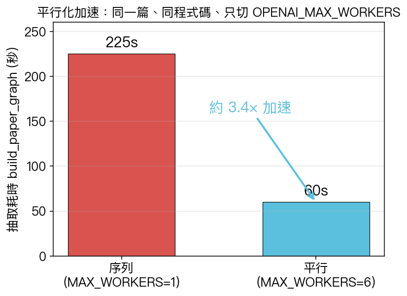
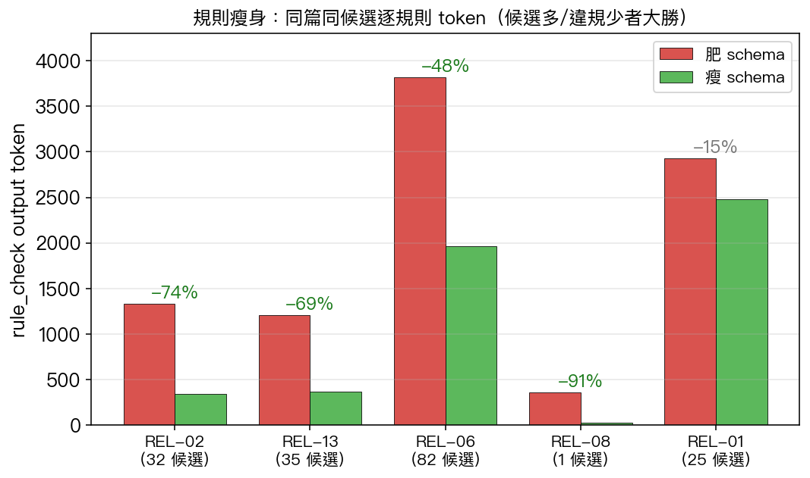
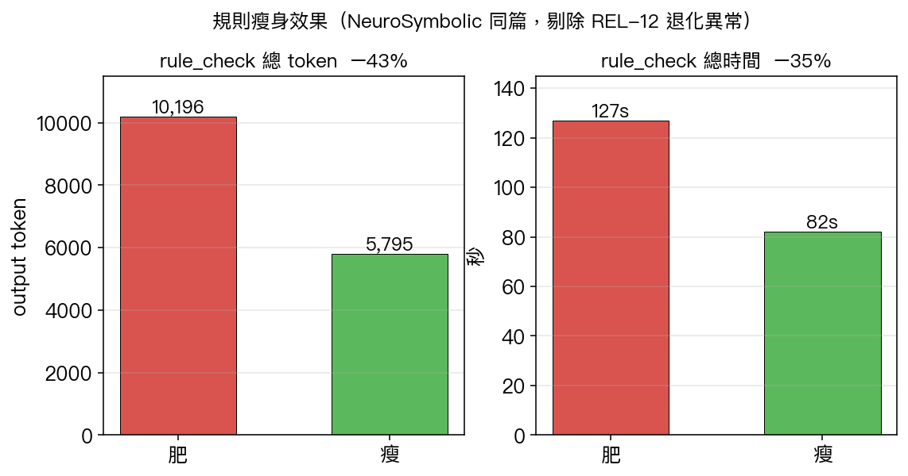
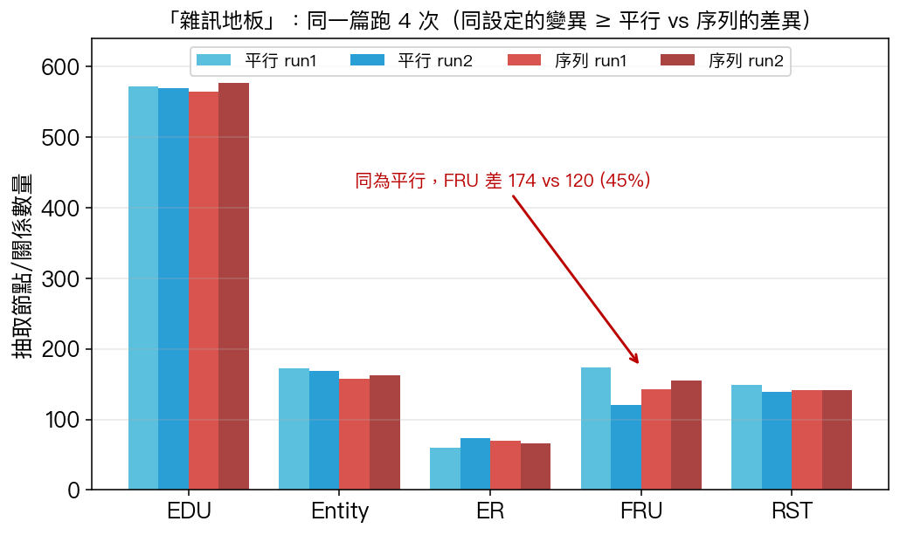
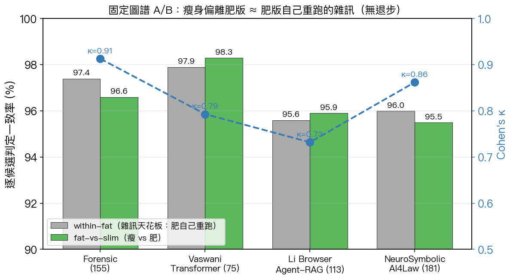
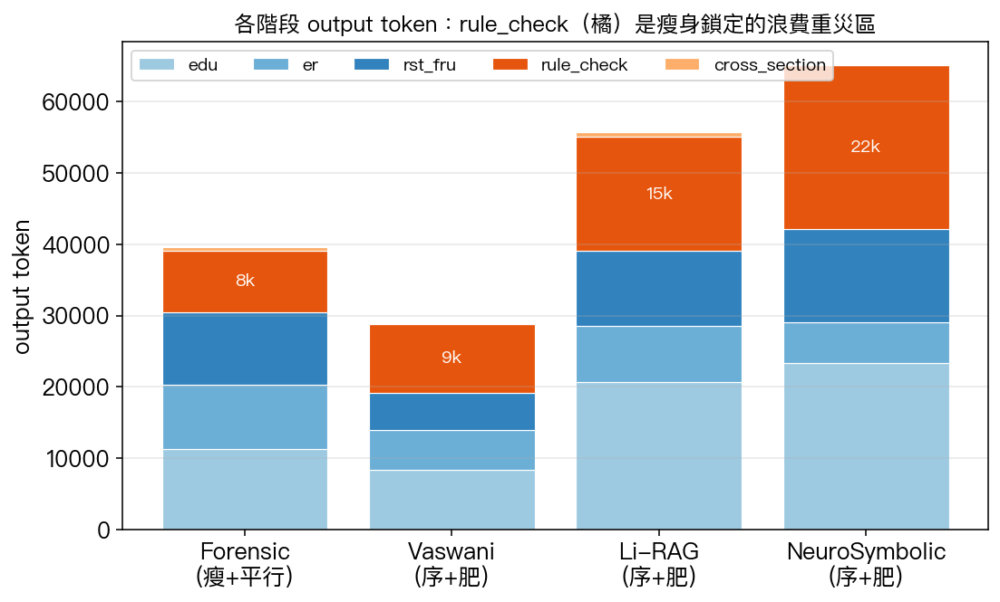
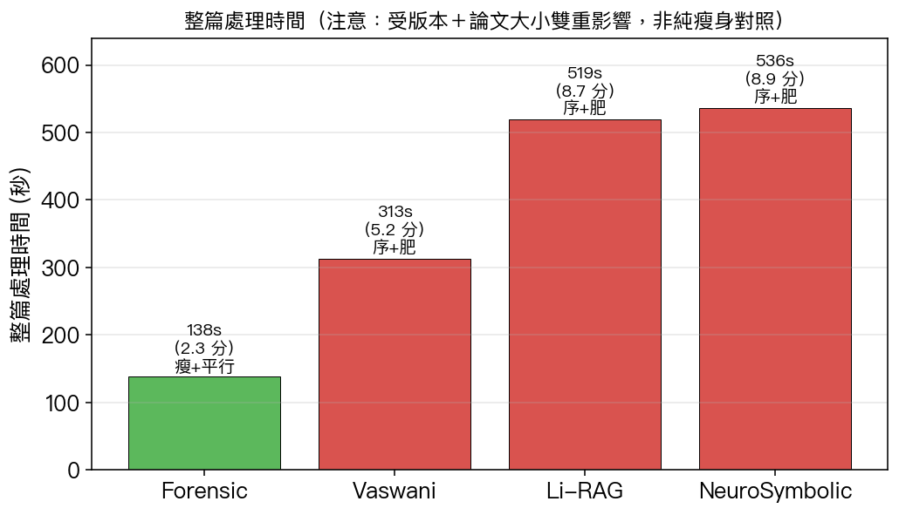
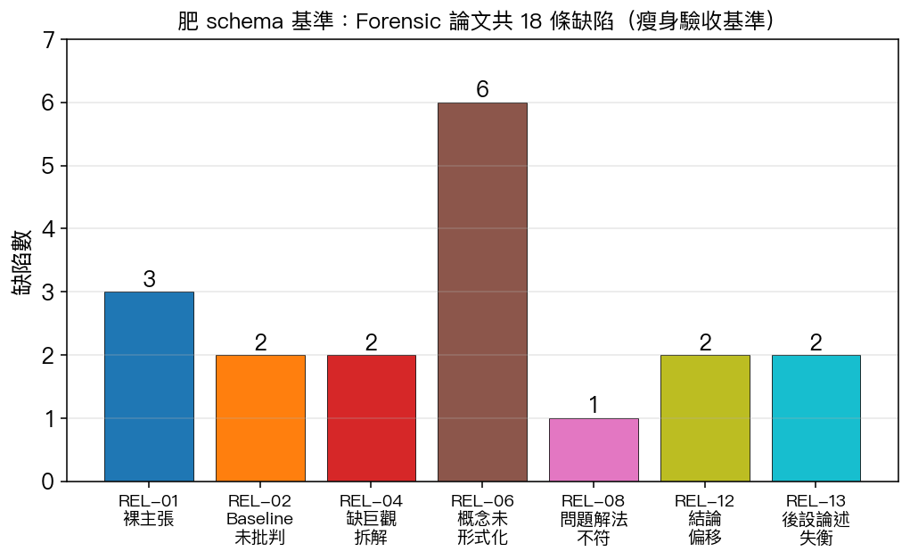

# 論文檢核系統 v3 — 進度投影片素材（3.1.0 之後 → 3.4.1）

> **用途**：給你做投影片的「詳細素材庫」。資訊刻意寫滿，你自己抓重點摘要即可。
> **涵蓋期間**：上次報告（3.1.0，2026-05-20）之後的所有工作 → 至 2026-05-25。
> **模型**：gpt-5.4 / gpt-5.4-mini（temperature=0）。**部署機台**：`140.115.54.62:8083`（WIDM 實驗室）。
> **圖檔**：本檔同層 `figures/`，可直接拖進投影片。

---

## 0. 一頁總覽（電梯簡報）

這一期做了四類事：

| 類別 | 版本 | 一句話 |
|---|---|---|
| 🚀 效能大改 | **3.3.0** | 分析流程**平行化 + 規則瘦身**：整篇從約 9 分鐘降到約 2 分鐘、rule_check token −43~49%、成本下降，**且用 4 篇論文的固定圖譜 A/B 證明判定品質沒退步**。 |
| ✨ 體驗功能 | **3.2.0 / 3.4.0** | 3.2.0 新版自動偵測更新橫幅；3.4.0 上傳免填標題（LLM 自動讀論文標題）。 |
| 🐞 精修 | **3.4.1**（待發） | 無法定位的缺陷不再給「在 PDF 中查看」假按鈕；REL-04/REL-12 統一走跨章節判定，定位率 100%。 |
| 🛠 維運 | — | 部署機台從 `.48/.58` 遷到公網直連的 `.62`；建立版本紀錄頁與語意化版本規範。 |

**對論文最有價值的一點**：在驗證效能改動的過程中，量化證實了「**神經抽取層 run-to-run 不可重現**」這個方法論事實，並據此設計出「**固定圖譜 A/B + 雜訊地板**」這套不需 ground truth 也能證明「無退步」的評估法。

---

## 1. 版本時間軸

```
3.0.0  2026-05-09  系統基線：KG + 13 條 REL 規則 + Human-as-judge
3.1.0  2026-05-20  PDF OCR 容錯 + 版本紀錄頁          ← 上次報告到這
─────────────────────────────────────────────────────  本期起點
3.2.0  2026-05-20  新版自動偵測 + 更新橫幅
3.3.0  2026-05-25  ★ 平行化 + 規則瘦身（效能大改 + A/B 驗證）
3.4.0  2026-05-25  論文標題自動偵測
3.4.1  （待發）     無定位缺陷修正 + REL-04/12 跨章節統一
```

語意化版本規範（本期建立，寫在 `frontend/lib/version-log.ts`）：
- **MAJOR** — 架構性破壞變更（換 KG schema、改 API 合約）
- **MINOR** — 新增向後相容功能（OCR 容錯、標題偵測）
- **PATCH** — bug 修復 / 不改對外行為（偵測閾值、文案、定位修正）

---

## 2. 效能大改（一）：分析流程平行化

### 為什麼要改
- 原本整篇分析是**完全序列**：每個章節段依序做 EDU→ER→RST/FRU 三次 LLM 抽取，再依序跑 13 條規則檢核。
- 一篇 20–30 頁論文要 **5–9 分鐘**，使用者體驗差，且每次 demo 都要等。

### 怎麼改
- 用 `ThreadPoolExecutor`，環境變數 `OPENAI_MAX_WORKERS`（預設 **6**，設 `1` 強制回序列）。
- 兩處平行：**① 章節抽取**（各章節段同時送）、**② 13 條規則檢核**（同時送）。
- `pool.map` **保序**，結果順序與序列版一致 → 不影響可重現性宣稱。
- 配套：`client()` / `driver()` 改 **thread-safe lazy singleton**（避免併發初始化 race）。

### 數據：同篇控制實驗（唯一變數＝worker 數）



| 設定 | 抽取耗時（build_paper_graph）|
|---|---|
| 序列 `MAX_WORKERS=1` | ~225s |
| 平行 `MAX_WORKERS=6` | ~60s |
| **加速** | **約 3.4×** |

> 這是**乾淨對照**：同一篇、同程式碼、同輸入 spans，只切 worker 數。整篇「9 分→2 分」還疊加了瘦身與論文大小因素（見第 4 節），不能全歸功平行化；純並發效果就是這 3.4×。

---

## 3. 效能大改（二）：規則判定瘦身（slimming）

### 為什麼要改
- 13 條規則每條都對「Cypher 撈出的候選」逐一請 LLM 判定（verdict）。
- 舊（肥）schema 要求 LLM **每個候選都填滿 8 個欄位**（defect_type / severity / confidence / evidence_edu_ids / description / suggestion …），**即使該候選根本沒違規**。
- 結果：**候選多、違規少**的規則（如 REL-06 一篇 63–82 個候選只 4–6 違規）產生海量「沒違規卻仍寫一堆說明」的廢棄 output token。

### 怎麼改
- verdict schema 的 `required` 從「全部 8 欄」縮成只剩 **`[candidate_index, violates]`**。
- 細節欄位**只在 `violates=true` 時才填**。非違規候選只回 `{index, violates:false}`，幾乎零 output。

### 數據：同篇同固定候選，只切 rule_check schema（NeuroSymbolic，各跑 3 次）



| 規則 | 候選 | 肥 token | 瘦 token | 變化 | 肥秒 | 瘦秒 |
|---|---|---|---|---|---|---|
| REL-08 | 1 | 357 | 31 | **−91%** | 8.0 | 1.0 |
| REL-02 | 32 | 1,330 | 341 | **−74%** | 14.8 | 4.2 |
| REL-13 | 35 | 1,211 | 371 | **−69%** | 12.5 | 4.7 |
| REL-06 | 82 | 3,814 | 1,967 | **−48%** | 42.5 | 24.8 |
| REL-01 | 25 | 2,928 | 2,478 | −15% | 37.9 | 34.7 |
| REL-12 ⚠️ | 1 | 456 | 3,614 | **異常** | 7.9 | 41.5 |



- **規律**：候選多、違規少的規則**大勝**（REL-02 −74%、REL-13 −69%、REL-06 −48%）；違規率高的規則（REL-01，25 候選 15 違規）持平；單候選是雜訊。
- **剔除 REL-12 異常後**：rule_check **token −43%、時間 −35%**（與另一篇 Forensic 量到的 −49% 一致）。

### ⚠️ 附帶發現的可靠性風險（誠實揭露）
- **REL-12**（單一候選）瘦版 3 次有 2 次發生 LLM **退化生成**：output 爆到 3,614 token / 41.5s（肥版僅 456 / 7.9s）。
- 推測：瘦 schema 欄位變寬鬆，偶爾讓模型在某些候選「跑飛」。
- 目前僅此 1 例，**已列入待觀察**（多跑看是否常見）；不影響「平均省 token」結論，但要記在風險清單。

---

## 4. 準確度驗證（本期方法論核心）

> **核心命題**：效能改了，**判定品質有沒有掉？** 沒時間做人工標註（ground truth），如何證明？

### 4.1 先踩到的坑：naive 重跑「不能比」

破 cache 把同一篇用瘦身版重跑，缺陷數從基準的 **18 → 31**。看起來像暴增，但：

| 指標 | 肥基準 | 瘦重跑 | 變化 |
|---|---|---|---|
| 缺陷總數 | 18 | 31 | ⚠️ 不可直接比 |
| 總 output | 49,351 | 39,645 | −20% |
| rule_check output | 16,887 | 8,633 | **−49%** |
| 成本 | $0.73 | $0.61 | −16% |

**為何不能比**：各規則的**候選數本身就變了**（REL-03 0→16、REL-01 13→24）。候選是 Cypher 從 KG 撈的 → 候選變＝上游抽出的 KG 不同 → 這是**抽取層的非決定性**，發生在規則之前，與瘦身無關。

### 4.2 量化「雜訊地板」：證明平行化無辜 + 抽取層不可重現

同一篇、同程式碼、同輸入，只切 worker 數，跑 4 次（2 平行 + 2 序列）：



| run | 設定 | EDU | Entity | ER | FRU | RST | 耗時 |
|---|---|---|---|---|---|---|---|
| par1 | 平行 | 572 | 172 | 60 | 174 | 149 | 67s |
| par2 | 平行 | 570 | 169 | 74 | 120 | 139 | 59s |
| seq1 | 序列 | 564 | 158 | 70 | 143 | 142 | 222s |
| seq2 | 序列 | 577 | 163 | 66 | 155 | 141 | 230s |

**關鍵讀法**：
- 同為平行的 par1 vs par2，光 FRU 就差 **174↔120（45%）**，比「平行 vs 序列」的均值差（147 vs 149）還大。
- seq 的每個值都落在 par 的範圍內 → **變異來自 LLM 抽取本身，不是平行化**。
- **平行化無辜**（只改速度不改內容），且 **FRU 最不穩**（同條件 ±20%+），這正是 4.1 候選暴動的根因。
- 結論：**任何準確度量測都不能單跑**，必須多跑取分布（老師要的「鬍鬚圖 / boxplot」）。

### 4.3 主驗證：固定圖譜 A/B（隔離 schema 這個唯一變數）

**方法**：取一張已建好的 KG（**凍結候選**當常數）→ 只切 verdict schema（肥/瘦）→ 對**同一批候選**各跑 5 次 → 逐候選比 `violates`。
抽取/平行化的雜訊被完全排除，唯一變數＝schema。
- **within-fat**（肥自己跑 5 次的兩兩一致率）＝ **雜訊天花板**。
- **fat-vs-slim ≈ within-fat** → 瘦身跟「肥再跑一次」分不出來 → **等價**。



| 論文 | 候選 | within-fat（雜訊天花板）| **fat-vs-slim** | Cohen's κ | 違規 肥→瘦 |
|---|---|---|---|---|---|
| Forensic | 155 | 97.4% | **96.6%** | 0.913 | ≈ |
| Vaswani-Transformer (2017) | 75 | 97.9% | **98.3%** | 0.793 | 2→3 |
| Li-Browser-Agent-RAG (2025) | 113 | 95.6% | **95.9%** | 0.732 | 10→6 |
| NeuroSymbolicAI4Law | 181 | 96.0% | **95.5%** | 0.862 | 21→20 |
| **合計** | **524** | — | — | — | — |

**判讀**：
- 四篇全部 **fat-vs-slim ≈ within-fat（差距 ±0.8% 內）** → 瘦身偏離肥版的程度 = 肥版自己重跑偏離自己的程度。**在雜訊內無法區分 → 瘦 ≡ 肥。**
- 違規數**沒有系統性方向**（Vaswani 瘦略多、Li-RAG 略少、NeuroSymbolic 幾乎同）→ 偏離是雜訊，不是系統性退步。
- κ 在違規稀少的篇較低（0.73–0.79）是 **κ 對低盛行率的已知敏感性**（高一致率但低 κ），非瘦身問題。

### 4.4 為什麼「瘦 ≡ 肥」就足夠（不需 ground truth）

> **前提**：老師已**口頭認可肥（舊）版**「還不錯」。
> 本驗證證的是 **「瘦 ≡ 肥」（no regression）** → 瘦版**繼承肥版的認可** → 不需重新做 ground truth 就能上線。

### 4.5 誠實但書（一定要寫進論文的限制）

1. 本報告證的是 **「瘦 ≡ 肥（無退步）」，不是「絕對準確（真不真實）」**。後者需 ground truth（perturbation 注入已知缺陷量 recall、或人工標）—— **另一條獨立工作線**。
2. **抽取層不可重現**：可重現性只對符號規則層成立，神經抽取層不成立 → 對論文的 ablation/evaluation 是方法論風險，評估時要多跑取分布或固定中間產物（KG）。
3. A/B 只比了「**違規決策 + 哪個候選**」，**未比** description/suggestion 的**文字內容**（自由生成，需語意相似度另測）。

---

## 5. 各篇處理量側寫（步驟結構 + token 分佈）

四篇走**同一條 pipeline**，差別只在「步驟**數量**」隨論文結構放大（章節段數、候選規則數）。
> 呼叫數 = 3×章節段 + 有候選規則數 + 1（cross-section）。例：Forensic 3×9+11+1 = 39。



| 階段 | Forensic（瘦）| Vaswani（肥）| Li-RAG（肥）| NeuroSymbolic（肥）|
|---|---|---|---|---|
| edu | 11,293 | 8,437 | 20,737 | 23,310 |
| er | 9,015 | 5,553 | 7,818 | 5,712 |
| rst_fru | 10,143 | 5,222 | 10,510 | 13,171 |
| **rule_check** | **8,633** | 9,638 | 15,978 | **22,938** |
| cross_section | 561 | 20 | 678 | 20 |



| 論文 | 版本 | 章節段 | 總呼叫 | 總 output | 成本 | 處理時間 |
|---|---|---|---|---|---|---|
| Forensic | 瘦+平行 | 9 | 39 | 39,645 | $0.61 | **138s（2.3 分）** |
| Vaswani | 序+肥 | 6 | 30 | 28,870 | $0.42 | 313s（5.2 分）|
| Li-RAG | 序+肥 | 7 | 34 | 55,721 | $0.86 | 519s（8.6 分）|
| NeuroSymbolic | 序+肥 | 7 | 33 | 65,151 | $1.10 | 536s（8.9 分）|

**讀法**：
- **rule_check 是最大成本/時間黑洞**（橘色），序列三篇佔總時間約 45–48% → 正是平行化 + 瘦身雙重受益的階段。NeuroSymbolic 肥版光 rule_check 就吃 22,938 token（$0.52）。
- ⚠️ 這張時間圖**不是純瘦身對照**：Forensic 是瘦+平行、其餘是序+肥，時間同時受**版本**與**論文大小**影響。乾淨對照看第 2 節（同篇 3.4×）與第 3 節（同篇 token −43%）。

---

## 6. 肥 schema 缺陷基準（瘦身驗收的對照基準）

Forensic 論文（肥版）共抓到 **18 條缺陷**，作為「瘦身不可掉以下這些」的回歸基準。



| 規則 | 缺陷類型 | 條數 |
|---|---|---|
| REL-01 | NakedClaim 裸主張 | 3 |
| REL-02 | BaselineNotCritiqued baseline 未批判 | 2 |
| REL-04 | NoMacroDecomposition 缺巨觀拆解 | 2 |
| REL-06 | ConceptNotFormalized 概念未形式化 | 6 |
| REL-08 | ProblemSolutionMismatch 問題解法不符 | 1 |
| REL-12 | ConclusionMisaligned 結論偏移 | 2 |
| REL-13 | MetaDiscourseImbalance 後設論述失衡 | 2 |

> 18 條逐條明細（章節 / 嚴重度 / 信心 / 中文說明 / 建議）見 `docs/baselines/forensic-fatschema-baseline.md` 附錄。

---

## 7. 體驗功能

### 7.1 新版自動偵測 + 更新橫幅（3.2.0）
- **問題**：使用者分頁開著舊版前端，部署新版後仍用到舊 bundle。
- **做法**：新增 `/version` 端點；前端 watcher 用 bundle 內建版本比對伺服器當前版本，不一致時於畫面底部顯示**不可關閉的更新橫幅**，點「立即更新」即重整。
- **檢查時機**：分頁重新聚焦（focus / visibilitychange）立即查，平常每 60 秒輪詢。

### 7.2 論文標題自動偵測（3.4.0）
- **問題**：上傳要手動輸入標題，麻煩且常與真實標題不符。
- **做法**：抽取後以 **gpt-5.4-mini 讀論文第一頁前約 1,500 字**取得標題（一次極輕量呼叫，成本可忽略）。使用者未填標題時自動套用；偵測失敗才退回檔名。
- **介面**：上傳表單標題欄改為**選填覆寫**，提示「留空則自動偵測」。

---

## 8. 精修：無定位缺陷修正（3.4.1，待發）

### 問題（使用者實際遇到）
某些缺陷（如 REL-04 NoMacroDecomposition）的「證據 EDU = 0 個」，卻仍顯示「📄 在 PDF 中查看」按鈕 → 點了沒反應。

### 根因
- REL-04 / REL-12 的 Cypher candidate_query **本身就不回傳 EDU id**（它們判的是「**結構缺失 / 全文不一致**」這種**沒有單一定位點**的問題）→ LLM 自然回空的 `evidence_edu_ids`。
- 對照：REL-06 的 query 有 `OPTIONAL MATCH MENTIONED_IN` 撈 EDU id，所以**有定位**。

### 兩道修正
1. **前端安全網**（`defect-panel.tsx`）：缺陷的 `evidence_edu_ids` 對不到任何圖譜節點時，**隱藏「在 PDF 中查看」按鈕**，不給假按鈕。
2. **後端治本**（`rules.py`）：REL-04 / REL-12 **統一只走 cross-section pass**（跨章節判定會**強制 ≥2 證據 EDU**），不再產生「逐章節版的無定位缺陷」。
   - 驗證：重跑 Forensic，REL-04/08/12 全部來自 cross-section、證據 8/9/8 個（有定位），**16 條缺陷 0 條無定位**（原本約 8% 無定位）。

> 狀態：兩個 commit 在 `feat/next`（尚未 push / 合併 / 部署）。屬 bug fix/refinement → 發版會是 **PATCH 3.4.1**。

---

## 9. 維運：部署機台遷移

```
.48  repo 文件寫死的舊機（DEPLOY.md / docker-compose.prod.yml / Caddyfile 內）
.58  2026-05-22 試用 → 前面有 NAT 閘道未轉發 8083 → 對外連不到 → 棄用
.62  網管改派，公網 IP 直接綁機器（無 NAT）→ 8083 對外直通 ✅ 現行
```

- **關鍵手法**：不改 repo 寫死的 .48，靠伺服器**根目錄 `.env` 覆寫** `PUBLIC_BASE` / `CORS_ORIGIN_REGEX` / `NEO4J_PASSWORD`。
- `PUBLIC_BASE` 會 cascade 成 `FRONTEND_URL` 與前端 build-time 的 `NEXT_PUBLIC_API_BASE` → **換 IP/port 一定要 `--build` 重建前端**。
- `.62` 已依序部署 3.1.0 → 3.3.0 → 3.4.0，皆驗證 `/version` 回正確版本、對外 IP 自打 8083 回 200。
- **已知小坑**：全新部署「第一篇上傳」常以 neo4j `TransientError()` 失敗（neo4j 暖機 + 建 constraint 撞 transient，非 OpenAI、非 code bug）→ **重傳即成功**。

---

## 10. 結語：可以對外講的一句話

> 本期把分析流程**平行化 + 規則判定瘦身**，rule_check output token 省約 43–49%、整篇處理（同篇純並發）加速約 3.4×、成本下降；並在 **4 篇論文、524 個候選**的**固定圖譜 A/B** 上證明瘦身與原版判定一致率（95.5–98.3%）與「原版自身重跑」的雜訊天花板**無法區分**（Cohen's κ 0.73–0.91），**無準確度退步**。過程中量化證實**神經抽取層 run-to-run 不可重現**，並建立「多跑取分布 + 固定中間產物」的評估方法論。

---

## 附錄 A：本期 commit 對照（給技術細節投影片）

| 版本 | 主要 commit | 內容 |
|---|---|---|
| 3.2.0 | `322c00e` | feat(frontend): detect new deploys and prompt a refresh |
| 3.3.0 | `396bef7` | perf(pipeline): parallelize section extraction and rule checks |
| 3.3.0 | `b72854a` | perf(rules): only emit verdict detail fields for actual violations（瘦身）|
| 3.3.0 | `da63379` | fix(concurrency): thread-safe lazy init for client()/driver() |
| 3.3.0 | `9995ae0` | test(pipeline): garble detection + OCR routing 單元測試 |
| 3.3.0 | `6ed95e9` | docs: 規則瘦身驗證報告（4 篇 A/B）|
| 3.3.0 | `466a182` / `597f21b` | merge feat/parallel-pipeline / 發版 3.3.0 |
| 3.4.0 | `ae1fe50` | feat(title): 未填標題時 LLM 自動偵測 |
| 3.4.0 | `4f4590c` / `6043b23` | merge feat/ui-polish / 發版 3.4.0 |
| 3.4.1（待） | `f64415c` | fix(ui): 無可定位證據時隱藏「在 PDF 中查看」按鈕 |
| 3.4.1（待） | `8ec871a` | fix(rules): REL-04/REL-12 只走 cross-section、消除無定位缺陷 |

> 回退路徑：`git revert -m 1 466a182`（再 revert 597f21b）即回肥 schema / 序列版。

## 附錄 B：實驗數據一覽（給數據投影片）

- **平行化加速**：同篇 build_paper_graph 序列 ~225s → 平行 ~60s（**3.4×**）。
- **雜訊地板**：同篇 4 跑，FRU 同設定差最大 45%；EDU 最穩（564–577，±2%）。
- **瘦身 token**（同篇同候選，rule_check）：REL-08 −91% / REL-02 −74% / REL-13 −69% / REL-06 −48% / REL-01 −15%；總計剔除異常後 **−43% token、−35% 時間**。
- **固定圖譜 A/B**：4 篇 524 候選，fat-vs-slim 95.5–98.3% ≈ within-fat 95.6–97.9%，κ 0.73–0.91。
- **缺陷基準**：Forensic 肥版 18 條（REL-06 最多 6 條）。

## 附錄 C：圖檔清單（figures/）

| 檔名 | 內容 | 建議用於哪張投影片 |
|---|---|---|
| `fig2_parallel_speedup.png` | 平行 vs 序列加速 3.4× | 第 2 節 平行化 |
| `fig3_noise_floor.png` | 雜訊地板（4 跑變異）| 第 4.2 節 抽取非決定性 |
| `fig4_slim_token_per_rule.png` | 逐規則瘦身 token | 第 3 節 瘦身 |
| `fig4b_slim_totals.png` | rule_check 總 token/時間 −43%/−35% | 第 3 節 瘦身 |
| `fig5_ab_agreement.png` | 固定圖譜 A/B 一致率 + κ | 第 4.3 節 主驗證 |
| `fig6_defect_baseline.png` | 18 條缺陷分佈 | 第 6 節 基準 |
| `fig7_stage_token_stack.png` | 各階段 token 堆疊 | 第 5 節 處理量 |
| `fig8_processing_time.png` | 整篇處理時間 | 第 5 節 處理量 |
