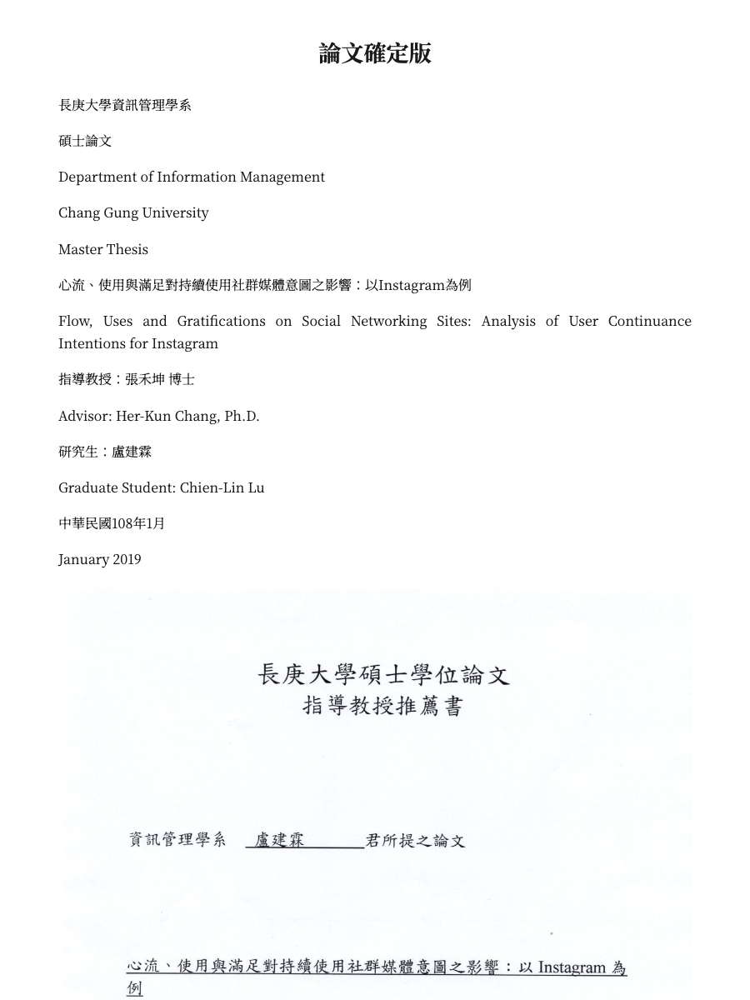
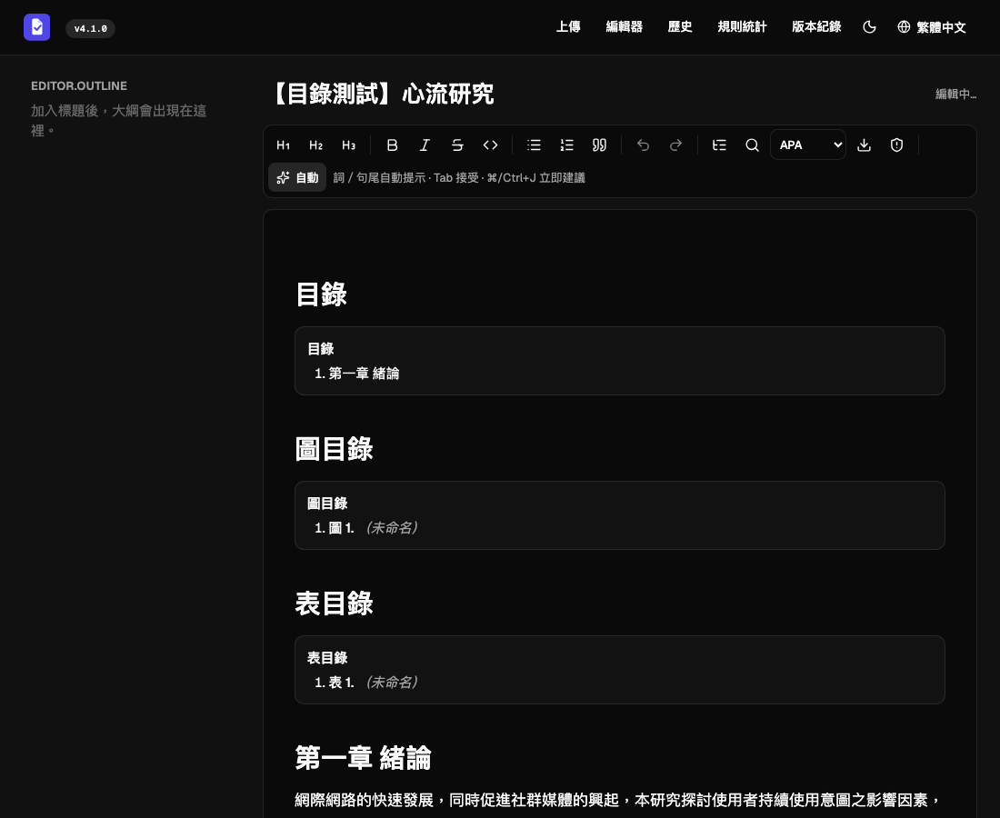
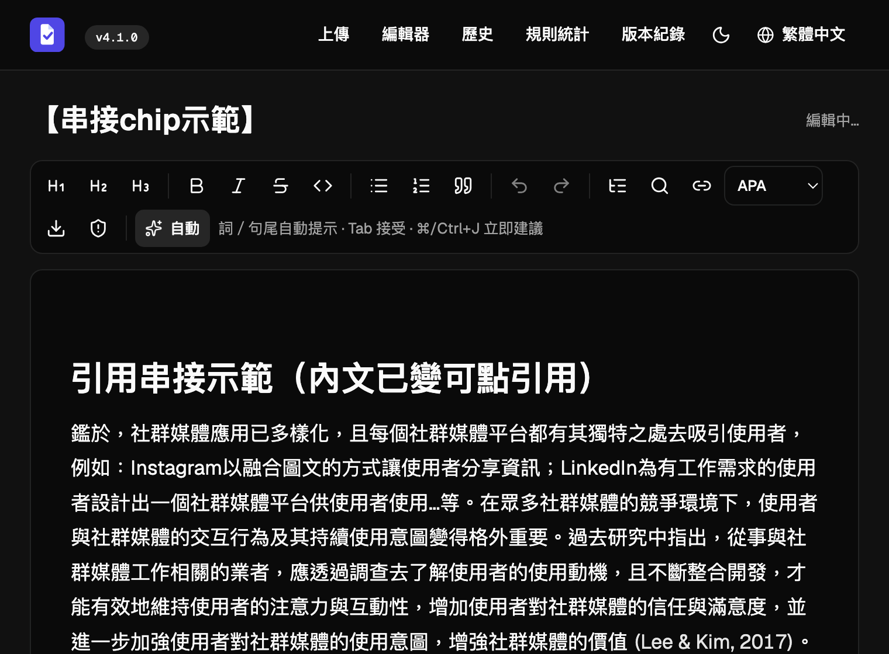

# 論文寫作編輯器 — 本期進度報告（雙向化 + 引用串接）

> **用途**：這次口頭報告的投影片大綱。每頁＝標題＋列點＋建議圖＋（口頭講稿）。
> **涵蓋**：寫作編輯器從「能寫、能匯出」→「**能匯入、能自動串引用**」；外加回答老師對「LLM 建議 JSON」與「A/B 測試圖」的兩個疑問。
> **圖檔**：本檔同層（`demo-*.png`、`fixed-graph-ab-test.png`）。JSON 完整範例見 `系統roadmap_LLM建議JSON_瘦身AB測試.md`。

---

## 投影片 1 — 封面 / 報告範圍

- 論文寫作編輯器：本期進度（雙向化 + 引用自動串接）
- 一句話：**編輯器從「只能往外匯出」變成「能把現成論文匯入、並自動把純文字引用接回可驗證的活引用」**
- 三條主軸：① 文件匯入 ② 匯入智慧（結構識別）③ 引用自動串接
- 外加：回答老師兩個疑問（LLM 建議 JSON、瘦身 A/B 測試）

> （講稿）上次報告系統有了一個 AI 寫作編輯器。這次的主題是「打通雙向」——讓使用者能把已經寫好的 Word/PDF 論文匯進來繼續編輯，而且把裡面死的純文字引用，自動接回我們系統可驗證的活引用。

---

## 投影片 2 — 一頁總覽（這期做了三類事）

| 類別 | 一句話 | 對使用者的價值 |
|---|---|---|
| 📥 文件匯入 | txt / Markdown / **Word** / LaTeX → 解析成編輯器內容繼續寫 | 不用從零開始，把現成論文搬進來 |
| 🧠 匯入智慧 | 目錄／圖表目錄／圖說表說／誤標題誤引言**自動修正** | 匯入的不是一坨亂文字，是有結構的論文 |
| 🔗 引用串接 | 內文引用 + 參考文獻 → 查 OpenAlex → **高信心才連** | 死引用變可點、可驗證、進引用面板 |

> （講稿）這三件事其實是一條龍：先把文件搬進來（匯入），再把它整理成有結構的論文（智慧識別），最後把引用接回我們的驗證引擎（串接）。

---

## 投影片 3 — 定位：編輯器是系統的第二支柱

```
第一支柱（既有）        第二支柱（本期完善）
分析「既有 PDF」    →   從零或從現成稿「寫論文」
PDF → KG → 13 REL          編輯器 + AI + 把 KG/規則引擎接到寫作端
        缺陷檢查                  即時護欄 / 引用驗證 / 引用串接
```

- 護城河：別人（Jenni AI 等）只有寫作功能；**我們把既有的知識圖譜 / 缺陷檢核 / 引用驗證引擎接到了寫作當下**
- 本期「匯入 + 引用串接」讓第二支柱能吃進「存量論文」，不只服務新稿

> （講稿）系統有兩支柱：一支是分析現成 PDF 找缺陷，一支是輔助寫作。這次讓寫作端能吃進「已經存在的論文」，等於把兩支柱接起來了。

---

## 投影片 4 — ① 文件匯入：四種格式 → 繼續寫



- 上傳 **.txt / .md / .docx / .tex** → 解析成編輯器節點，**表格、圖片正確還原**
- 技術：`mistune`（Markdown AST）、`python-docx`（走訪 + 內嵌圖存檔）、手寫 LaTeX 子集 parser
- 引用無法還原（匯出時 metadata 就丟了）→ 先留純文字，由「投影片 7」的串接補回

> （講稿）這是把一份 Word 論文匯進來後的樣子，連掃描的審定書圖片、表格都還原了。唯一還原不了的是引用的學術 metadata，因為那在匯出成文字時就丟了——這就引出後面的「引用串接」。

---

## 投影片 5 — ② 匯入智慧：把「亂文字」整理成「有結構的論文」



真實論文匯入時遇到的四個坑，全部自動修正：

| 問題 | 現象 | 自動修正 |
|---|---|---|
| Word 目錄是 field | 匯入變一堆空白殘骸 | →「目錄/圖目錄/表目錄」**活節點**（自動編號、可點跳轉） |
| 內文被套 Heading style | 309 個假標題污染大綱 | → 長句/句末標點**降級回正文**（309→110） |
| 圖說/表說獨立成段 | 圖目錄全「未命名」 | → 抓進 figure/table 標題（圖 10/14、表 20/34） |
| 參考文獻被套 Quote style | 整批變引言框 | → **拆回正常段落**（99→0） |

> （講稿）真實的 Word 論文匯進來其實很髒——目錄是空殼、內文被當標題、參考文獻變引言框。這頁是系統自動把它們修正後的樣子，目錄是「活」的、點了會跳到對應章節。

---

## 投影片 6 — ③ 引用串接：方法論（為什麼「寧缺勿錯」）

- 目標：把內文 `(Author, year)` 純文字 → 可點、可驗證的活引用
- **難點**：這篇是中文碩論——大量網路資源、中文文獻，OpenAlex 根本沒有
- **錯誤的做法**：粗略關鍵字直接查 → 會把引用連到**不相關的論文**（誤導讀者，比不連更糟）
- **我們的高信心策略（三道關卡）**：
  1. **LLM 精準解析** 每條參考文獻 → 標題／作者／年份／是否學術
  2. **OpenAlex 查詢** 學術類
  3. **Embedding 相似度驗證**（cosine ≥ 0.80）才採用——**寧缺勿錯**

> （講稿）引用串接最大的風險不是漏連，是「連錯」。如果把某個引用連到一篇不相關的論文，那是誤導。所以我們的原則是寧缺勿錯：用 LLM 精準解析、再用語意相似度把關，只連有十足把握的。

---

## 投影片 7 — ③ 引用串接：實證數據 + Demo



真實論文（107 條參考文獻）跑下來：

```
參考文獻 107 → 判定學術類 80 → 高信心比中 48 篇 → 內文串上 18 處
```

- 比中的都**正確**：boyd & Ellison、Bhattacherjee、Csikszentmihalyi、Goffman…（相似度 0.94–1.00）
- 串上的引用**自動進「引用面板」**當引用依據，可看 DOI、可做引用驗證（紅綠燈）
- 誠實限制：48 比中、18 串上——很多內文是 `Smith (2018)` 敘述式或只有 `(2018)`，目前只接括號內 `(Author, year)`，可後續增強

> （講稿）這是串接後的效果，內文這個藍色的「(Lee & Kim, 2017)」原本是死的純文字，現在可以點、可以驗證。48 比中、18 串上的落差是因為很多引用是敘述句式，這是下一步要補的。

---

## 投影片 8 — 老師疑問①：「有缺失才丟 LLM 找建議」的 JSON

- 規則層先用知識圖譜撈**候選**句，再逐一丟 LLM 判定
- **關鍵：只有「違規」的候選，LLM 才寫 `description`／`suggestion`／`confidence`**；沒違規只回 `{candidate_index, violates:false}`
- 必填只有 `candidate_index` + `violates`，其餘是「違規才填」

```json
{ "verdicts": [
  { "candidate_index": 0, "violates": true,
    "severity": "high", "section": "Introduction",
    "evidence_edu_ids": ["edu_12"],
    "description": "強比較主張但無數據/引用支撐（The Naked Claim）。",
    "suggestion": "補量化證據或指向實驗章節（見表 N）。",
    "confidence": 0.88 },
  { "candidate_index": 1, "violates": false }
] }
```

> 完整「肥版 vs 瘦版」對照 JSON 見 `系統roadmap_LLM建議JSON_瘦身AB測試.md`。
> （講稿）老師問丟給 LLM 的格式長怎樣。重點是：沒違規的候選只回兩個欄位，不浪費 token 寫一堆說明——這就是「瘦身」，也是下一頁 A/B 測試在驗的東西。

---

## 投影片 9 — 老師疑問②：固定圖譜 A/B 測試（瘦身無退步）


- **為什麼測**：瘦身省 token，但會不會掉準確度？直接重傳比缺陷數**行不通**（抽取層不可重現，缺陷數自己會跳）
- **解法**：把知識圖譜**凍結**，肥/瘦各跑 5 次，**逐候選**比 `violates`（控制變因）
- **兩條基準**：灰柱＝肥自己重跑（雜訊天花板）、綠柱＝瘦 vs 肥、藍線＝Cohen's κ
- **結論**：綠 ≈ 灰、四篇 524 候選都在 ±0.8% 內 → **瘦身無退步**，且**不需 ground truth**

> （講稿）老師對這張圖的背景有疑問。核心是：我們沒辦法直接比缺陷數（因為神經抽取每次都不一樣），所以把圖譜凍結，只比 LLM 判定。綠柱跟灰柱幾乎一樣高，代表瘦身造成的差異，落在模型自己重跑的雜訊裡——所以沒退步。

---

## 投影片 10 — 接下來（Roadmap）

| 優先 | 項目 | 說明 |
|---|---|---|
| 近期 | 引用串接增強 | 接敘述式 `Smith (2018)`、提高串上率 |
| 近期 | PDF 匯入 | 盡量還原表格圖片 |
| 中期 | 個人語料接地 / KG 接地 Reviews | 用已分析語料 grounding 寫作、標矛盾/無支撐 |
| 評估 | 擾動敏感度 benchmark | 程式化破壞論文造已知缺陷量召回（絕對準確度） |
| 維運 | 帳號 + 多人併發 | user 維度 + ownership 檢查；分析併發佇列 + SQLite WAL |

> （講稿）下一步分三塊：把引用串接做得更全、把 PDF 也能匯入，以及往評估方法論和多人維運走。

---

## 附：一句話總結（給結尾）

> **這期把寫作編輯器「打通成雙向」**：能匯入現成論文、自動整理結構、並用「高信心、寧缺勿錯」的策略把死引用接回可驗證的活引用——讓既有論文也能享受系統的引用驗證與缺陷檢核。
