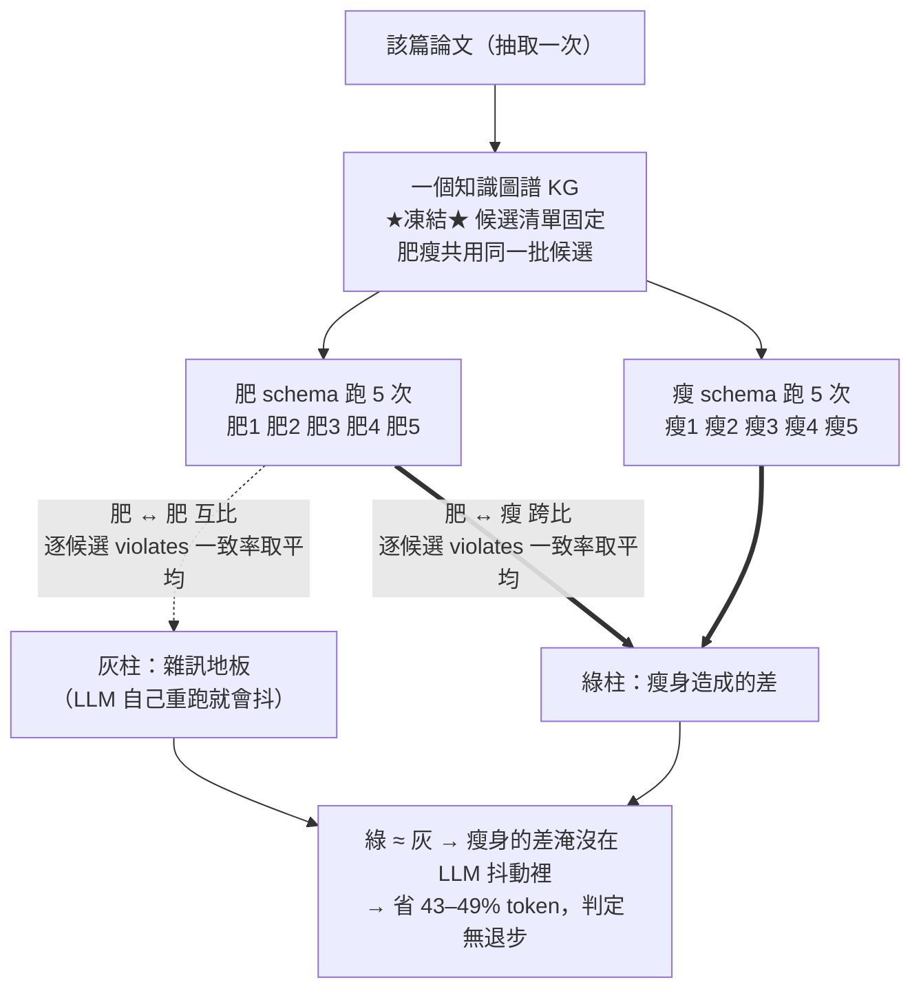

# 本期進度報告 — 系統架構與內容（PPT 用稿）

> **用途**：做 PPT 的逐頁素材。每頁＝標題＋要點＋建議放的圖＋（口頭講稿）。
> **圖檔（同層）**：`system-architecture.png`（架構圖）、`demo-import-preview.png`、`demo-toc.png`、`demo-citation-relink.png`、`fixed-graph-ab-test.png`。
> **對齊老師 follow-up**：本稿第 8–9 頁專門回應 `系統roadmap_LLM建議JSON_瘦身AB測試.md` 內老師要追的兩件事（LLM 建議 JSON、瘦身 A/B 測試），第 10 頁是 roadmap 接下來項目。

---

## 投影片 1 — 封面

- **論文檢核與 AI 寫作系統 — 本期進度報告**
- 一句話定位：**把一篇論文拆成知識圖譜、用規則檢出「結構性缺陷」，再把同一套引擎接進一個會即時護欄的 AI 寫作編輯器。**
- 本期主軸：①（新）放上**整體系統架構圖** ②寫作編輯器「打通雙向」＝匯入 + 引用自動串接 ③回應老師兩個 follow-up

> （講稿）這次報告先用一張架構圖把整個系統講清楚，再聚焦這期做的「匯入 + 引用串接」，最後回答老師上次留的兩個問題。

---

## 投影片 2 — 系統整體架構（核心頁）

系統整體架構

- **兩支柱 + 一條護城河 + 共用基礎設施**：
  - **支柱① 分析既有 PDF（缺陷檢核引擎）**：PDF → 切句(EDU) → 實體關係(ER) → 修辭/功能結構(RST/FRU) → **Neo4j 知識圖譜** → **13 條 REL 規則** → 缺陷清單（證據句＋建議）
  - **支柱② 編AI 寫作輯器**：匯入 / 寫作核心 / Block 編輯 / 匯出 / 智慧引用
  - **護城河（紅）**：把支柱①的 KG／規則／引用引擎**接進寫作當下** → B-M1 引用驗證、B-M2 缺陷前移、B-M3 引用接地
  - **共用基礎設施**：OpenAI LLM（gpt-5.4 / mini / embeddings）、OpenAlex、Neo4j、SQLite、檔案儲存
- 前端 Next.js 15 + TipTap v3 + Zustand；後端 FastAPI（REST + SSE 串流 + 背景任務佇列）

> （講稿）整個系統是兩支柱：左邊把現成 PDF 拆成知識圖譜、用規則找缺陷；右邊是 AI 寫作編輯器。中間紅色那條是我們的差異化——別人只有寫作功能，我們把左邊那套缺陷/引用引擎接到了寫作當下。最下面是大家共用的基礎設施。

---

## 投影片 3 — 為什麼是「兩支柱」：定位與護城河

```
第一支柱（既有）              第二支柱（本期完善）
分析「既有 PDF」          →   從零 / 從現成稿「寫論文」
PDF → KG → 13 REL 缺陷檢核     編輯器 + AI + 把 KG/規則引擎接到寫作端
                              即時護欄 / 引用驗證 / 引用串接
```

- 對標 Jenni AI：別人只有「寫作功能」；**我們獨有的是把既有知識圖譜 / 缺陷檢核 / 引用驗證引擎接進寫作**
- 本期讓第二支柱能吃進「**存量論文**」（匯入 + 串接），不只服務新稿 → 兩支柱真正接起來

> （講稿）這頁解釋為什麼要有兩支柱、護城河在哪。重點是這期讓寫作端能吃進已經存在的論文，把兩支柱打通。

---

## 投影片 4 — 本期一頁總覽（做了三類事）


| 類別      | 一句話                                             | 對使用者的價值            |
| ------- | ----------------------------------------------- | ------------------ |
| 📥 文件匯入 | txt / Markdown / **Word** / LaTeX → 解析成編輯器內容繼續寫 | 不用從零開始，把現成論文搬進來    |
| 🧠 匯入智慧 | 目錄／圖表目錄／圖說表說／誤標題誤引言**自動修正**                     | 匯入的不是一坨亂文字，是有結構的論文 |
| 🔗 引用串接 | 內文引用 + 參考文獻 → 查 OpenAlex → **高信心才連**            | 死引用變可點、可驗證、進引用面板   |


> （講稿）這三件事是一條龍：先把文件搬進來，再整理成有結構的論文，最後把引用接回我們的驗證引擎。

---

## 投影片 5 — ① 文件匯入：四種格式 → 繼續寫

匯入後的論文式預覽

- 上傳 **.txt / .md / .docx / .tex** → 解析成編輯器節點，**表格、圖片正確還原**
- 技術：`mistune`（Markdown AST）、`python-docx`（走訪 + 內嵌圖存檔）、手寫 LaTeX 子集 parser
- 引用無法還原（匯出時 metadata 就丟了）→ 先留純文字，由「投影片 7」的串接補回

> （講稿）這是把一份 Word 論文匯進來的樣子，連審定書掃描圖、表格都還原了。唯一還原不了的是引用的學術 metadata——這就引出後面的引用串接。

---

## 投影片 6 — ② 匯入智慧：把「亂文字」整理成「有結構的論文」

目錄/圖目錄/表目錄變成活節點

真實 Word 論文匯入時遇到的四個坑，全部自動修正：


| 問題                 | 現象           | 自動修正                                  |
| ------------------ | ------------ | ------------------------------------- |
| Word 目錄是 field     | 匯入變一堆空白殘骸    | →「目錄/圖目錄/表目錄」**活節點**（自動編號、可點跳轉）       |
| 內文被套 Heading style | 309 個假標題污染大綱 | → 長句/句末標點**降級回正文**（309→110）           |
| 圖說/表說獨立成段          | 圖目錄全「未命名」    | → 抓進 figure/table 標題（圖 10/14、表 20/34） |
| 參考文獻被套 Quote style | 整批變引言框       | → **拆回正常段落**（99→0）                    |


> （講稿）真實 Word 論文很髒——目錄是空殼、內文被當標題、參考文獻變引言框。這頁是系統自動修正後的樣子，目錄是「活」的、點了會跳到對應章節。

---

## 投影片 7 — ③ 引用串接：方法論 + 實證

內文 (Author, year) 變成可點的藍色引用

- 目標：內文 `(Author, year)` 純文字 → 可點、可驗證的活引用
- **難點**：中文碩論大量網路資源／中文文獻，OpenAlex 根本沒有；粗略關鍵字查會**連到不相關論文**（誤導，比不連更糟）
- **高信心策略（三道關卡，寧缺勿錯）**：① LLM 精準解析每條參考文獻 → ② OpenAlex 查學術類 → ③ **Embedding 相似度驗證（cosine ≥ 0.80）才採用**
- **實證**（真實論文 107 條參考文獻）：

```
參考文獻 107 → 判定學術類 80 → 高信心比中 48 篇 → 內文串上 18 處
```

- 比中的都**正確**（boyd & Ellison、Bhattacherjee、Csikszentmihalyi…相似度 0.94–1.00），串上的引用**自動進引用面板**可驗證
- 誠實限制：48 比中、18 串上——很多內文是 `Smith (2018)` 敘述式或只有 `(2018)`，目前只接括號式，下一步補

> （講稿）引用串接最大的風險不是漏連，是連錯。所以原則是寧缺勿錯：LLM 精準解析 + 語意相似度把關，只連有十足把握的。藍色那個引用原本是死的純文字，現在可以點、可以驗證。

---

## 投影片 8 — 老師 follow-up ①：「有缺失才丟 LLM 找建議」的 JSON

> 對應 `系統roadmap_LLM建議JSON_瘦身AB測試.md` 第二節（完整肥/瘦對照 JSON 在該檔）。

- 規則層先用知識圖譜（Cypher）撈**候選**句，再逐一丟 LLM 判定
- **關鍵：只有「違規」的候選，LLM 才寫 `description`／`suggestion`／`confidence`**；沒違規只回 `{candidate_index, violates:false}`
- 必填只有 `candidate_index` + `violates`，其餘「違規才填」→ 這就是**規則瘦身**

```json
{ "verdicts": [
  { "candidate_index": 0, "violates": true,
    "severity": "high", "section": "Introduction",
    "evidence_edu_ids": ["edu_12"],
    "description": "強比較主張但無數據/引用支撐（The Naked Claim）。",
    "suggestion": "補量化證據或指向實驗章節（見表 N）。",
    "confidence": 0.88 },
  { "candidate_index": 1, "violates": false }
] }
```

> （講稿）老師問丟給 LLM 的格式長怎樣。重點是沒違規的候選只回兩個欄位，不浪費 token——這就是瘦身，也是下一頁 A/B 測試在驗的東西。

---

## 投影片 9 — 老師 follow-up ②：固定圖譜 A/B 測試（瘦身無退步）

固定圖譜 A/B 測試

> 對應 `系統roadmap_LLM建議JSON_瘦身AB測試.md` 第三節。

### 方法論流程圖（資料怎麼產生、灰/綠柱怎麼算）




**讀法（三個最容易誤解的點）**：

- **只有一個 KG、凍結一次**（消掉抽取層不可重現）——不是肥瘦各撈一版。
- **建 KG 用抽取 schema（EDU/ER/RST/FRU），跟肥瘦無關、沒有兩版 KG**；肥/瘦只是最後判 `violates` 的 `VERDICT_SCHEMA` 兩版，都接在同一個凍結 KG 後面。
- **灰柱＝肥 vs 肥**（雜訊地板）、**綠柱＝肥 vs 瘦**（改動的差）；比的是**逐候選 violates 一致率**，**不是 violate 個數**（個數相同也可能逐候選全不同）。
- **為什麼測**：瘦身省 ~43–49% token，但會不會掉準確度？直接重傳比缺陷數**行不通**（神經抽取層不可重現，缺陷數自己會跳，曾觀察 18→31）
- **解法（控制變因）**：把知識圖譜**凍結**，肥 schema 跑 5 次、瘦 schema 跑 5 次，**逐候選**比 `violates`
- **兩條基準**：灰柱＝肥自己重跑（LLM 雜訊天花板）、綠柱＝瘦 vs 肥、藍線＝Cohen's κ
- **結論**：綠 ≈ 灰、四篇 **524 候選**都在 ±0.8% 內 → **瘦身無退步**，且**不需 ground truth**（因為老師已認可肥版「還不錯」，證明「瘦 ≡ 肥」就夠）


| 論文                         | 灰：肥自己重跑 | 綠：瘦 vs 肥 | κ    |
| -------------------------- | ------- | -------- | ---- |
| Forensic (155)             | 97.4%   | 96.6%    | 0.91 |
| Vaswani Transformer (75)   | 97.9%   | 98.3%    | 0.79 |
| Li Browser Agent-RAG (113) | 95.6%   | 95.9%    | 0.73 |
| NeuroSymbolic AI4Law (181) | 96.0%   | 95.5%    | 0.86 |


### 判準：多少數值算「差異不大、驗證通過」

- **決定性判準（最重要）**：**|綠 − 灰| ≤ ~1 個百分點** → 瘦身造成的差落在 LLM 自己重跑的抖動內、分不出來。本判準採**等效性檢定**框架 ⁽¹⁾⁽²⁾，以肥版自身重跑變異（灰柱）作為等效界（SESOI 之經驗界）⁽³⁾。本實驗四篇都 **≤ 0.8%** ✅
- **輔助錨點**：一致率 **≥ 95%**、Cohen's **κ ≥ 0.6** ⁽⁴⁾⁽⁵⁾⁽⁶⁾。本實驗 **95.5–98.3%** / κ **0.73–0.91**，全達標 ✅
- **三個指標一起報**，缺一不可：% 看整體穩定、κ 證明扣掉運氣仍一致 ⁽⁵⁾、|綠−灰| 才是「無退步」的證據。

**κ 解讀表（Landis & Koch, 1977 慣例 ⁽⁴⁾）**：


| κ 範圍            | 解讀                       |
| --------------- | ------------------------ |
| < 0.20          | 幾乎沒一致（≈亂猜）               |
| 0.21 – 0.40     | fair（勉強）                 |
| 0.41 – 0.60     | moderate（中等）             |
| **0.61 – 0.80** | **substantial（相當一致）**    |
| **0.81 – 1.00** | **almost perfect（近乎完全）** |


> ⚠️ **kappa paradox（要主動說明，防老師反問）**：當「不違規」佔絕大多數（base rate 很偏）時，**一致率很高、κ 卻會被數學壓低** ⁽⁷⁾⁽⁸⁾——例如 Li 那篇 95.6% 卻只有 κ=0.73，不是品質差，是違規太稀有。所以一致率與 κ 要**並列解讀**，別只看 κ（高一致率情境亦可改用 Gwet's AC1 ⁽⁹⁾）。

#### 註腳／參考文獻

1. Lakens, D., Scheel, A. M., & Isager, P. M. (2018). Equivalence testing for psychological research: A tutorial. *Advances in Methods and Practices in Psychological Science, 1*(2), 259–269.
2. Schuirmann, D. J. (1987). A comparison of the two one-sided tests procedure and the power approach for assessing the equivalence of average bioavailability. *Journal of Pharmacokinetics and Biopharmaceutics, 15*(6), 657–680.
3. Bland, J. M., & Altman, D. G. (1986). Statistical methods for assessing agreement between two methods of clinical measurement. *The Lancet, 327*(8476), 307–310.
4. Landis, J. R., & Koch, G. G. (1977). The measurement of observer agreement for categorical data. *Biometrics, 33*(1), 159–174.
5. Cohen, J. (1960). A coefficient of agreement for nominal scales. *Educational and Psychological Measurement, 20*(1), 37–46.
6. McHugh, M. L. (2012). Interrater reliability: The kappa statistic. *Biochemia Medica, 22*(3), 276–282.
7. Feinstein, A. R., & Cicchetti, D. V. (1990). High agreement but low kappa: I. The problems of two paradoxes. *Journal of Clinical Epidemiology, 43*(6), 543–549.（第 II 篇：Cicchetti & Feinstein, 1990, 43(6), 551–558）
8. Byrt, T., Bishop, J., & Carlin, J. B. (1993). Bias, prevalence and kappa. *Journal of Clinical Epidemiology, 46*(5), 423–429.
9. Gwet, K. L. (2008). Computing inter-rater reliability and its variance in the presence of high agreement. *British Journal of Mathematical and Statistical Psychology, 61*(1), 29–48.

> （講稿）我們沒辦法直接比缺陷數（神經抽取每次都不一樣），所以把圖譜凍結、只比 LLM 判定。綠柱跟灰柱幾乎一樣高，代表瘦身造成的差異落在模型自己重跑的雜訊裡——所以沒退步。
> 註：這證明「瘦身相對肥版沒退步」；論文的**絕對準確度**是另一條線（擾動敏感度 benchmark，見下頁 roadmap）。

---

## 投影片 10 — 接下來（Roadmap｜五條軸線）

> 對應 `系統roadmap_LLM建議JSON_瘦身AB測試.md` 第一節 + 中文來源計畫 `atomic-snacking-whale.md`（階段 A–D）。
> 上次報告只列 6 條平列項目；這次依「軸線」收斂，**軸線 ① 是這陣子討論後新長出來的一整條**（中文引用來源 + 接地品質）。

### 軸線 ①　智慧引用：覆蓋與品質（本期討論後新增最多）

| 節奏 | 項目 | 說明 |
| --- | --- | --- |
| 近期 | **引用串接增強** | 接敘述式 `Smith (2018)` / 只有 `(2018)`，提高串上率（目前 48 比中→18 串上） |
| 近期 | **中文來源 A：CrossRef** | 加第二來源補「有 DOI 的中文期刊」；鏡像 `openalex.py` 介面、一樣套 0.80 相似度閘門（寧缺勿錯，連不到就維持純文字） |
| 中期 | **中文來源 B：NDLTD 台灣碩博論** | OAI-PMH／Open Data 收割 → 本地索引（重用接地的 `paper_chunks` 向量模式）；對症台灣中文碩論、工程量大，先做可行性探針 |
| 中期 | **接地 chunking 品質** | 切句前清噪音（references／表格／頁首版權）、調高最短句門檻、段落級切塊；實測全文接地約 31% 是 PDF 噪音碎片 |

### 軸線 ②　匯入 / 匯出深化

| 節奏 | 項目 | 說明 |
| --- | --- | --- |
| 近期 | **PDF 匯入** | 盡量還原表格圖片（pymupdf 已備） |

### 軸線 ③　護城河深化（把分析引擎接得更進寫作）

| 節奏 | 項目 | 說明 |
| --- | --- | --- |
| 中期 | 個人語料接地 / KG 接地 Reviews | 用已分析語料 grounding 寫作、標矛盾／無支撐／過度宣稱 |

### 軸線 ④　評估方法論（論文的學術貢獻線）

| 節奏 | 項目 | 說明 |
| --- | --- | --- |
| 評估 | **擾動敏感度 benchmark** | 程式化破壞乾淨論文造已知缺陷→量召回，補上「**絕對準確度**」；與本期已完成的瘦身 A/B（相對無退步）互補成「相對＋絕對」兩條線 |

### 軸線 ⑤　工程 / 維運 / 儲存

| 節奏 | 項目 | 說明 |
| --- | --- | --- |
| 維運 | 帳號 + 多人併發 | user 維度 + ownership 檢查；分析併發佇列 + SQLite WAL |
| 量大再做 | 儲存優化 | `paper_chunks.embedding` JSON→float32 BLOB（砍 4 倍）、快取 LRU 淘汰 |
| M4 | Guardrails / 文法 lint / 台灣學位論文格式 | 協助 vs 代寫 + PII 偵測 |


> （講稿）下一步收成五條軸線。最厚的是軸線①「智慧引用」——上次只說要接敘述式引用，但深入後發現中文來源是個大坑：OpenAlex 對台灣碩論幾乎是空的，要補 CrossRef 跟台灣碩博論網，連帶把全文接地的 chunk 品質清乾淨。其餘四條：匯入深化、護城河深化、評估方法論（補絕對準確度），跟維運／儲存。

---

## 附：一句話總結（結尾頁）

> **這期把寫作編輯器「打通成雙向」**：能匯入現成論文、自動整理結構、並用「高信心、寧缺勿錯」的策略把死引用接回可驗證的活引用——讓既有論文也能享受系統的引用驗證與缺陷檢核。整體架構＝**兩支柱（分析 / 寫作）＋ 一條護城河（把缺陷引擎接進寫作）**。

