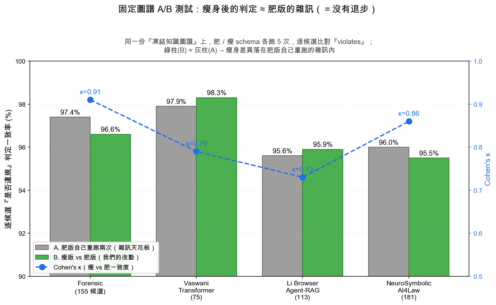

# 論文檢核系統 — 投影片素材

> 本檔三節：①系統 Roadmap（做了什麼／要做什麼）②「有缺失才丟 LLM 找建議」的 JSON 範例（回答老師疑問）③固定圖譜 A/B 測試圖的解讀（重畫＋說明）。

---

## 一、系統 Roadmap

### 系統定位
一句話：**把一篇論文拆成知識圖譜，用規則去檢查「結構性缺陷」，再延伸成一個會即時護欄的 AI 寫作編輯器。**

核心流程（分析既有 PDF）：

```
PDF → EDU(切句) → ER(實體關係) → RST/FRU(修辭/功能結構)
    → Neo4j 知識圖譜(KG) → 13 條 REL 規則檢核 → 缺陷清單(含證據句+建議)
```

### 已完成（依時間軸）

| 版本 | 里程碑 | 重點 |
|------|--------|------|
| 核心引擎 | EDU→ER→RST/FRU→KG→13 REL 規則 | 把「論點缺證據／方法缺動機／概念沒定義／結論不對齊」變成可自動偵測的缺陷 |
| **3.3.0** | 平行化 + **規則瘦身** + 驗證報告 | 抽取平行化快 ~3.4×；verdict schema「只在違規才填細節」省 token（**見第三節 A/B 測試**） |
| 3.4.0 | 標題自動偵測 | LLM 自動辨識論文標題 |
| 3.6–3.7 | 介面專業化、全域任務追蹤 | |
| **3.8.0** | 多國語系（繁中／英）+ 深色模式 | locale-as-data：加語言零 schema 變動 |
| **4.0.0** | **AI 寫作編輯器**（TipTap v3 + Zustand） | 從「分析既有 PDF」擴張到「從零寫論文」 |
| ↳ Phase A | AI 改寫 / 大綱生成 / DOCX·LaTeX 匯出 / 六種引用格式 | 補齊與 Jenni AI 同級的寫作功能 |
| ↳ Phase C | Slash 選單 / 圖片+圖目錄 / KaTeX 數學 / 表格+表目錄 | Notion 式 block 編輯 |
| **4.1.0** | **差異化護城河（Phase B）** | 把既有的 KG/缺陷引擎接到寫作端 |
| ↳ B-M1 | 引用紅綠燈驗證 | 點引用 → LLM 判「這篇來源是否真的支撐你的論點」🟢🟡🔴 |
| ↳ B-M2 | 缺陷檢查前移 | 13 REL 規則跑在「正在寫的草稿」當下，行內波浪底線 |
| ↳ B-M3 | 全文句級引用接地（真 RAG） | 抓 OA 全文→切句→embedding→指出「原文哪一句支撐你」 |
| 未發版 | 匯出強化、多格式匯出（PDF/MD/TXT/HTML/論文字體） | 圖片內嵌、LaTeX 雙欄/期刊模板、zip 打包 |
| 未發版 | **文件匯入**（.txt / .md / .docx / .tex → 編輯器） | 表格圖片還原；**目錄／圖目錄／表目錄自動識別成活節點**；誤判 heading 自動降級 |

### 進行中／預計要做

| 優先 | 項目 | 說明 |
|------|------|------|
| 進行中 | **引用自動串上（高信心策略）** | 匯入論文的純文字引用 → LLM 精準解析 + OpenAlex + 相似度驗證，**寧缺勿錯**只連高度確定的；中文/網路資源保持純文字 |
| next | PDF 匯入 | 盡量還原表格圖片（pymupdf） |
| Phase B 續 | 個人語料接地 / KG 接地 Reviews / forensic 引用誤用偵測 | 用使用者已分析的語料 grounding 寫作；標矛盾/無支撐/過度宣稱 |
| 評估 | **benchmark 評估台** | 擾動敏感度回歸台：程式化破壞乾淨論文造已知缺陷→量召回；AAAI vs WASET 區辨力；雜訊地板 boxplot |
| M4 | Guardrails（協助 vs 代寫 + PII）/ 文法 lint / 台灣學位論文格式 | |

---

## 二、「有缺失才丟 LLM 找建議」的 JSON 範例

> 老師的疑問：規則檢查時，到底丟什麼給 LLM、LLM 回什麼？這裡用 **REL-01（主張–證據）** 走一遍真實的輸入／輸出。

### 設計重點（這就是「規則瘦身」）
規則層先用知識圖譜（Cypher）撈出**候選**句子，再把候選丟給 LLM 逐一判定。
**關鍵：只有「違規」的候選，LLM 才需要寫 `description`／`suggestion`／`severity` 等細節；沒違規的只回 `violates:false`** —— 省下大量 token（例：REL-06 有 62 個候選但只有 5 個違規，瘦身後不必為 57 個沒違規的候選硬寫繁中說明）。

### 輸入給 LLM（示意）

```text
規則 REL-01（Claim-Evidence）：
每個主張(Claim)都應有對應證據(Evidence)支撐 —— 量化數據、引用、實驗結果或邏輯推論。
孤立、無支撐的主張(The Naked Claim)是缺陷。

請逐一判定下列候選主張是否違規：
[0] (edu_12) 「本方法在準確率上大幅超越現有所有方法。」
[1] (edu_45) 「我們在 5 個資料集上評估，平均提升 3.2%（見表 2）。」
[2] (edu_77) 「此設計顯著降低了使用者的認知負擔。」
```

### verdict JSON 的完整欄位

| 欄位 | 型別 | 說明 | 肥版 | 瘦版 |
|------|------|------|:---:|:---:|
| `candidate_index` | int | 對應第幾個候選 | 必填 | 必填 |
| `violates` | bool | 是否違規 | 必填 | 必填 |
| `severity` | high/medium/low | 嚴重度 | 一律填 | **僅 true 填** |
| `section` | enum | 所在章節 | 一律填 | **僅 true 填** |
| `evidence_edu_ids` | string[] | 釘回原文哪幾句(EDU) | 一律填 | **僅 true 填** |
| `description` | string | 為什麼違規 | 一律填 | **僅 true 填** |
| `suggestion` | string | 具體怎麼補 | 一律填 | **僅 true 填** |
| `confidence` | 0.0–1.0 | 這判定多確定 | 一律填 | **僅 true 填** |

### 肥版 JSON（舊版：每個候選都填滿，含 violates:false 也填）

```json
{
  "verdicts": [
    {
      "candidate_index": 0,
      "violates": true,
      "severity": "high",
      "section": "Introduction",
      "evidence_edu_ids": ["edu_12"],
      "description": "「大幅超越現有所有方法」是強比較性主張，但句子與鄰近脈絡未提供任何數據、引用或實驗結果，屬於孤立的裸主張(The Naked Claim)。",
      "suggestion": "補上量化證據或指向實驗章節，例如：『在 X 資料集上較 baseline 提升 Y%（見表 N）』，或加註支持文獻。",
      "confidence": 0.88
    },
    {
      "candidate_index": 1,
      "violates": false,
      "severity": "low",
      "section": "Experiment",
      "evidence_edu_ids": ["edu_45"],
      "description": "此主張自帶量化數據（平均提升 3.2%）並指向表 2，證據充分，未違反主張–證據規則。",
      "suggestion": "無需修改。",
      "confidence": 0.95
    },
    {
      "candidate_index": 2,
      "violates": true,
      "severity": "medium",
      "section": "Discussion",
      "evidence_edu_ids": ["edu_77"],
      "description": "「顯著降低認知負擔」使用統計意涵的『顯著』，但未引用使用者研究、量表或統計檢定結果。",
      "suggestion": "補上使用者實驗數據（如 NASA-TLX 分數、p 值）或改為較保守的描述。",
      "confidence": 0.71
    }
  ]
}
```

### 瘦版 JSON（現行：violates:false 只回兩個欄位）

```json
{
  "verdicts": [
    {
      "candidate_index": 0,
      "violates": true,
      "severity": "high",
      "section": "Introduction",
      "evidence_edu_ids": ["edu_12"],
      "description": "「大幅超越現有所有方法」是強比較性主張，但句子與鄰近脈絡未提供任何數據、引用或實驗結果，屬於孤立的裸主張(The Naked Claim)。",
      "suggestion": "補上量化證據或指向實驗章節，例如：『在 X 資料集上較 baseline 提升 Y%（見表 N）』，或加註支持文獻。",
      "confidence": 0.88
    },
    {
      "candidate_index": 1,
      "violates": false
    },
    {
      "candidate_index": 2,
      "violates": true,
      "severity": "medium",
      "section": "Discussion",
      "evidence_edu_ids": ["edu_77"],
      "description": "「顯著降低認知負擔」使用統計意涵的『顯著』，但未引用使用者研究、量表或統計檢定結果。",
      "suggestion": "補上使用者實驗數據（如 NASA-TLX 分數、p 值）或改為較保守的描述。",
      "confidence": 0.71
    }
  ]
}
```

### 怎麼讀（給老師的重點）
1. **唯一差別在 `violates:false` 的候選**：肥版逼 LLM 為「沒違規」的候選也寫一整套繁中 `description`／`suggestion`（候選 1），瘦版只回 `{candidate_index, violates:false}`。
2. **違規的候選（0、2）肥瘦完全一樣**——都填滿 `description`（為什麼違規）＋`suggestion`（怎麼補）＋`confidence`。
3. 真實案例：REL-06 一篇有 62 個候選但只有 5 個違規 → 肥版要為 57 個沒違規的候選硬寫繁中說明，**約 7k output token 純浪費**；瘦版省掉。
4. `evidence_edu_ids` 把缺陷釘回**原文哪一句**（EDU），前端才能「點定位、行內底線」。
5. **這就是 A/B 測試在比的東西**：把肥/瘦兩版都丟在同一份凍結圖譜上跑，比每個候選的 `violates` 判定是否一致（第三節）。

---

## 三、固定圖譜 A/B 測試圖（重畫＋解讀）



### 為什麼要做這個測試？（老師最想懂的「動機」）
我們把規則檢核**瘦身**了（verdict schema 只在違規才填細節，省 ~43–49% rule_check token）。
**老師最關心的問題是：省 token 會不會讓「抓缺陷的準確度」退步？**

直接「重傳同一篇、比缺陷數」**行不通**——因為上游 LLM 抽取(EDU/ER)本身**不可重現**，同一篇重跑兩次的知識圖譜就不一樣，缺陷數會自己跳動（曾觀察到 18→31）。所以缺陷數的差異**分不清**是「瘦身造成」還是「抽取雜訊造成」。

### 解法：固定圖譜 A/B（控制變因）
1. 對一篇論文，**抽取一次、把知識圖譜「凍結」**（候選集合固定不變）。
2. 在這個凍結圖上，**肥 schema 跑 5 次、瘦 schema 跑 5 次**。
3. **逐候選**比對 LLM 判定的 `violates`（是否違規），算一致率。

這樣唯一的變因就只剩「schema 肥/瘦」，抽取雜訊被凍結圖排除掉了。

### 兩條對照基準（圖上兩種柱子）
- **灰柱 A＝within-fat**：肥版**自己跟自己**重跑的一致率 → 這是 **LLM 本身的「雜訊天花板」**（連同一版重跑都不會 100% 一致）。
- **綠柱 B＝fat-vs-slim**：**瘦版 vs 肥版**的一致率 → 我們改動造成的差異。
- **藍線 κ**：Cohen's κ，扣掉「碰運氣猜對」後的一致度（0.7+ 已是 substantial、0.8+ near-perfect）。

### 資料內容
四篇不同領域論文、共 **524 個候選**：
Forensic(155) ／ Vaswani Transformer(75) ／ Li Browser Agent-RAG(113) ／ NeuroSymbolic AI4Law(181)。

| 論文 | A 灰：肥自己重跑 | B 綠：瘦 vs 肥 | κ |
|------|:---:|:---:|:---:|
| Forensic (155) | 97.4% | 96.6% | 0.91 |
| Vaswani Transformer (75) | 97.9% | 98.3% | 0.79 |
| Li Browser Agent-RAG (113) | 95.6% | 95.9% | 0.73 |
| NeuroSymbolic AI4Law (181) | 96.0% | 95.5% | 0.86 |

### 結論（一句話）
**綠柱(瘦 vs 肥) ≈ 灰柱(肥自己重跑)，四篇都落在 ±0.8% 內。**
也就是「瘦身造成的差異」小到**跟肥版自己重跑的隨機雜訊一樣大、無法區分** → **瘦身沒有讓判定退步（no regression）**。
因為老師先前已口頭認可舊（肥）版「還不錯」，所以證明「瘦 ≡ 肥」就足以說明沒掉準確度，**不需要另外做 ground truth 標註**。

> 註：這證明的是「瘦身相對肥版沒退步」。論文的**絕對準確度**是另一條線（擾動敏感度 benchmark），見 Roadmap。
